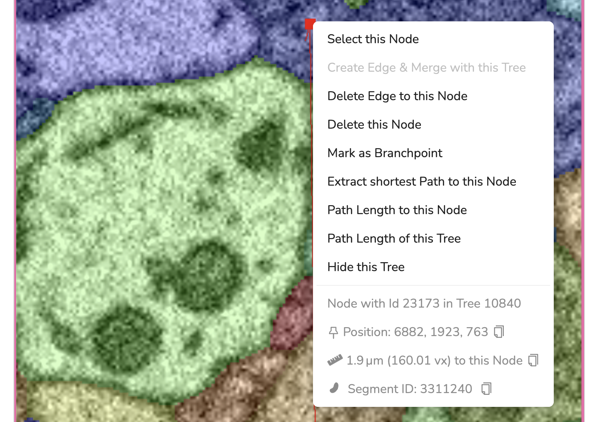

# Skeleton operations

## Operations with the Context Menu

WEBKNOSSOS has a context menu that can be opened via _Right Click_. This context menu offers useful context-sensitive information and most operations should be available through it:

Example operations include (but are not limited to):

- Clicking on a node:
    - measuring the path length of the active node to the selected node
    - measuring the path length of a tree
    - node deletion
    - marking a node as branchpoint
    - tree merging & splitting
    - extracting shortest path to a node
    - hiding tree
- Clicking on a volume segmentation:
    - compute or load its 3D mesh
    - flood-filling the segment (assigning a new ID)
- Clicking on the background data:
    - Creating a new node or tree
    - Creating a new bounding box

## Merging / Splitting Trees

Common tree operations include splitting and merging trees.

- `Tree splitting` can be done in two ways:

  1. Delete the node at which to split. This can be done by right-clicking a node and choosing "Delete this Node". If you have enabled _Classic Controls_, you need to select (_SHIFT + Left Click_) the node first and then delete (_DEL_) it.
  2. Delete an edge between two nodes. Select the first node (_Left Click_), then right-click the second node and select _Delete Edge to this Node_. If you have enabled _Classic Controls_, you need to select the first node with _Shift + Left Click_ and then click on the second node with _SHIFT + CTRL + Left Click_ on the second node of the edge to delete this connection.

- `Tree merging` works similarly to edge deletion but will create a new edge between two previously unconnected trees. Select the first node and right-click on a second one to choose _Create Edge & Merge with this Tree_. When using _Classic Controls_, the second node needs to be selected with _SHIFT + ALT + Left Click_ to create an edge between the two.

