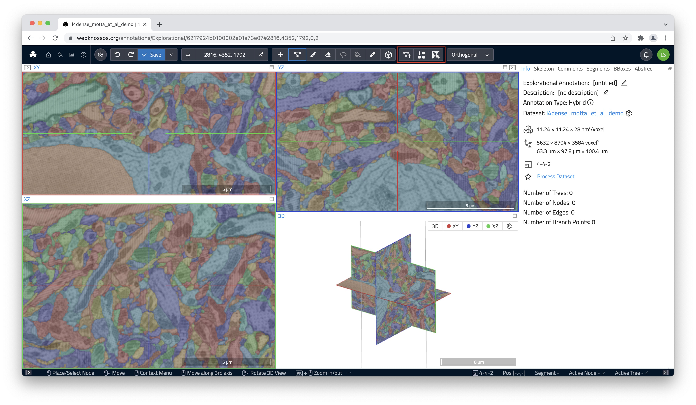

# Skeleton Annotation Tools

## Using the Skeleton Annotation tool

A skeleton annotation is a graph of connected nodes. Edges connect the nodes and form trees. Once the Skeleton Tool is activated in the toolbar, you can place nodes by left-clicking. The active node is always highlighted with a circle around it. Move the node by dragging. To create a new Tree, you can click the `Create a new Tree` icon in the toolbar or press the shortcut ++c++. 

Many organic structures do not follow a single, linear path but split into several individual branches instead. WEBKNOSSOS natively supports marking nodes as branch points. Any node can be marked as a branch point using the keyboard shortcut ++b++ or through the right-click menu. Branch points are highlighted using a slightly different color. All branch points are stored as a first-in, first-out (FIFO) stack. Press ++j++ to jump to the latest branch point in FIFO-order to continue working from there and remove it from the stack.

- `Skeleton`: Create skeleton annotations and place nodes with a left mouse click. Read more below.

When the `Skeleton` tool is active, the following modifiers become available:

- `Create new Tree`: Creates a new tree.
- `Toggle single node tree mode`: This modifier makes the skeleton annotation tool create a new tree for each node instead of adding nodes to the current tree. You can use this mode to mark single objects or seeds, such as nuclei. This is also known as "Soma-clicking mode".
- `Toggle merger mode`: This modifier activates the `Merger Mode` for the skeleton annotation tool. In merger mode, you can use skeletons to "collect" and merge volume segments from an over-segmentation. [Read more about `Merger Mode`](../proofreading/merger_mode.md).

- `Skeleton`: Create skeleton annotations and place nodes with a left mouse click. Read more below.

When the `Skeleton` tool is active, the following modifiers become available:

- `Create new Tree`: Creates a new tree.
- `Toggle single node tree mode`: This modifier makes the skeleton annotation tool create a new tree for each node instead of adding nodes to the current tree. You can use this mode to mark single objects or seeds, such as nuclei. This is also known as "Soma-clicking mode".
- `Toggle merger mode`: This modifier activates the `Merger Mode` for the skeleton annotation tool. In merger mode, you can use skeletons to "collect" and merge volume segments from an over-segmentation. [Read more about `Merger Mode`](../proofreading/merger_mode.md).

## Controls & Keyboard Shortcuts for Skeleton Annotations

| Key Binding | Operation                                          |
| ----------- | -------------------------------------------------- |
| Left Click  | Create New Node                                    |
| Left Click  | Select Node (Mark as Active Node) under the cursor |
| Left Drag   | Move around                                        |
| Left Drag   | Move the node under the cursor                     |
| ++s++           | Center Camera on Active Node                       |
| ++del++         | Delete Active Node                                 |
| ++b++           | Create Branch Point                                |
| ++j++           | Jump to Last Branch Point                          |
| ++c++           | Create New Tree                                    |

A full list of keyboard shortcuts is [available here](../ui/keyboard_shortcuts.md).