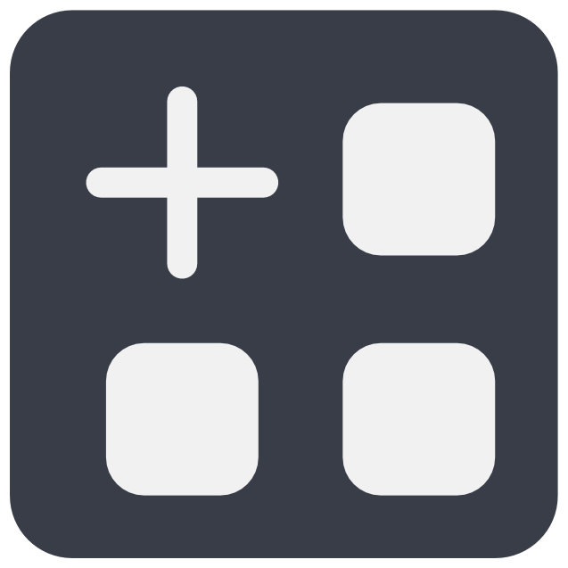

# Skeleton Annotation Tools

Skeleton annotation in WEBKNOSSOS allows you to create graph-like structures by placing connected nodes in 3D space. This is particularly useful for tracing neurons and other branching structures.

{align=left width="60"} 
The **Skeleton tool** enables you to create and edit skeleton annotations:

- Place nodes with precise positioning
- Connect nodes to form tree structures
- Add branches and create complex neural tracings

## Basic Concepts

A skeleton annotation consists of:

- **Nodes**: Individual points placed in 3D space (created with left-click)
- **Edges**: Connections between nodes that form trees
- **Trees**: Collections of connected nodes and edges
- **Branch Points**: Special nodes marking where a structure splits into multiple paths

The active node is always highlighted with a circle and can be moved by dragging.

## Creating Annotations

### New Trees
- Select the **Skeleton** tool from the toolbar
- Create a new tree using the toolbar button or press ++c++
- Each tree can represent a different structure or part of your annotation
- Trees are listed and can be managed in the [right sidebar](trees_list.md)

### Branch Points
- Mark any node as a branch point using ++b++ or the right-click menu
- Branch points are highlighted with a distinct color
- All branch points are stored in a first-in, first-out (FIFO) stack
- Jump to the latest branch point using ++j++ to continue working from there

### Tool Modes

The following additional modes are available for the skeleton tool beyond the basic functionality:

{align=left width="60"} 
**Create new Tree**

- Starts a fresh tree structure
- Useful when annotating multiple separate structures

{align=left width="60"} 
**Single Node Tree Mode**

- When enabled, creates a new tree for each placed node
- Perfect for marking individual objects (e.g., cell nuclei)
- Also known as "Soma-clicking mode"

{align=left width="60"} 
**Merger Mode**

- Enables using skeletons to merge volume segments
- Useful for correcting over-segmentation
- Learn more about [Merger Mode](../proofreading/merger_mode.md)

{align=left width="60"} 
**Skeleton Pen Mode**

- If this mode is enabled, the skeleton tool behaves similarly to the brush tool: holding down the left mouse button and dragging the mouse will continuously create nodes.
- Selecting or moving nodes via drag-and-drop is disabled in this mode.

## Skeleton Keyboard Shortcuts 

The following common keyboard shortcuts are handy for speeding up your annotation workflow:

| Key Binding | Operation                                          |
| ----------- | -------------------------------------------------- |
| Left Click  | Create New Node                                    |
| Left Click  | Select Node (Mark as Active Node) under the cursor |
| Left Drag   | Move around                                        |
| Left Drag   | Move the node under the cursor                     |
| ++s++           | Center Camera on Active Node                       |
| ++del++         | Delete Active Node                                 |
| ++b++           | Create Branch Point                                |
| ++j++           | Jump to Last Branch Point                          |
| ++c++           | Create New Tree                                    |

!!! tip "Keyboard Shortcuts"
    For faster workflows, refer to the [keyboard shortcuts](../ui/keyboard_shortcuts.md) guide.
