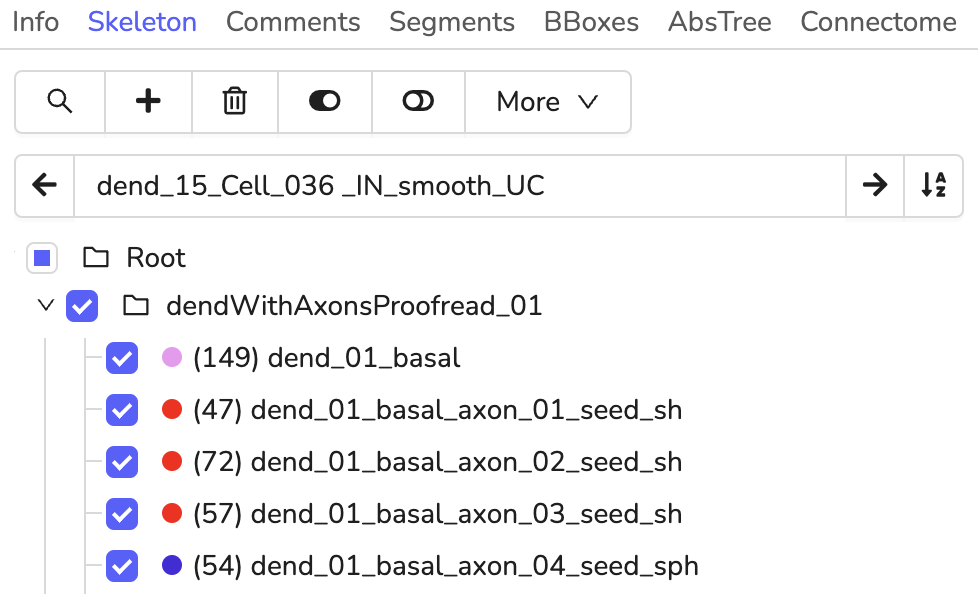
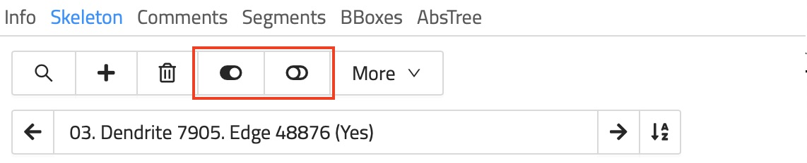

# Skeleton Tree List
## Tree groups

A typical skeleton annotation consists of one or more trees.
Trees can be nested and organized in so-called `Tree Groups`.
Tree groups can have a name and are used to structure and label your annotation even further.
Trees can be dragged and dropped between tree groups.
This action can be applied to multiple trees by selecting them with Ctrl + Left Mouse (on Mac OS Cmd + Left Mouse).
Right-click on an existing tree group to bring up a menu for creating new (sub-)groups or to delete a group.
Renaming of a group can be done by selecting a group and then entering a new name into the input above the tree hierarchy structure view.

## Tree Colors

A random color is assigned to each tree upon creation.
Colors can be shuffled for a single tree or for all trees in a skeleton.
Right-click on a tree to bring up several actions, e.g. `Shuffle Color`.
When editing several trees, use the overflow menu under `More` in the `Skeleton` tab and select `Change Color` or `Shuffle All Colors` to assign new randomly chosen colors.
All nodes have the same color as their parent tree and can not be changed individually.
The active node, branch points, and nodes that have comments assigned to them are highlighted with a slight variation of the tree's color.

## Skeleton & Tree Visibility

The visibility of individual trees can be toggled to hide some trees for a better overview.
Toggle the checkbox before each tree name or tree group to hide/show it.
Alternatively, the visibility of all trees can be toggled all at once using the `Toggle Visibility of All Trees` / `Toggle Visibility of Inactive Trees` button under the `Skeleton` Tab.
There are also keyboard shortcuts to quickly toggle the visibility:

| Key Binding | Operation                           |
| ----------- | ----------------------------------- |
| 1           | Toggle Visibility of all Trees      |
| 2           | Toggle Visibility of Inactive Trees |

