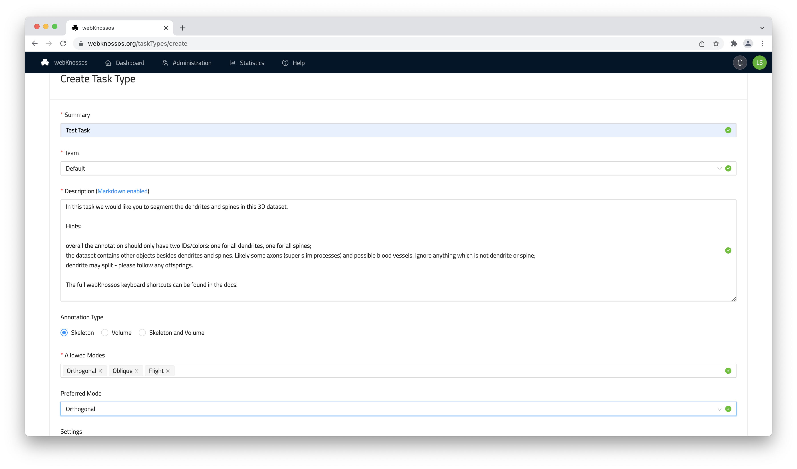
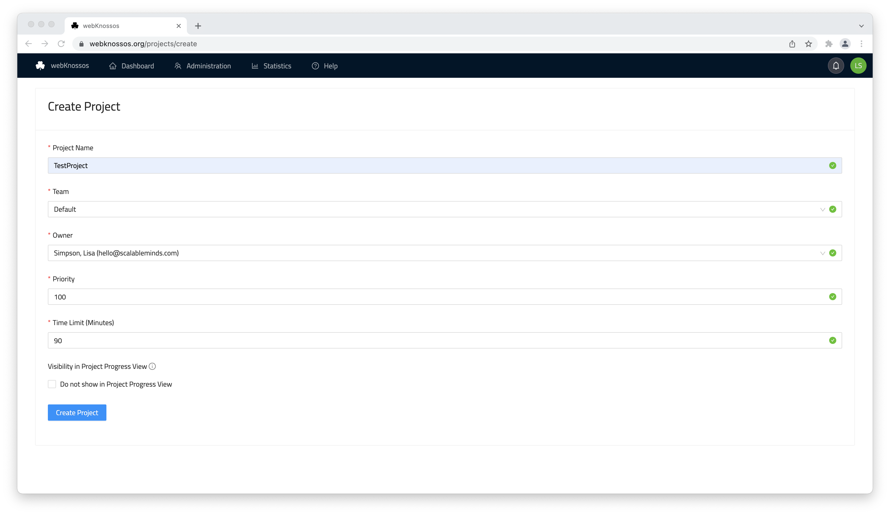
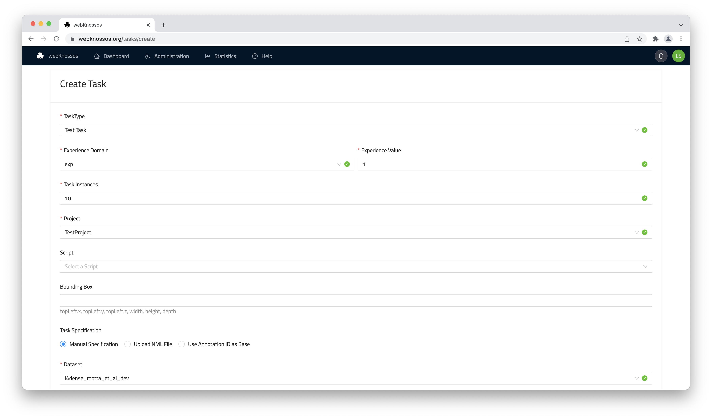
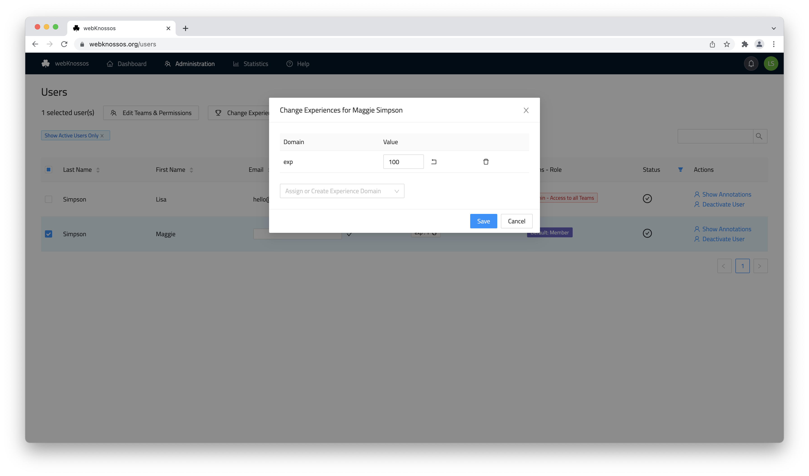
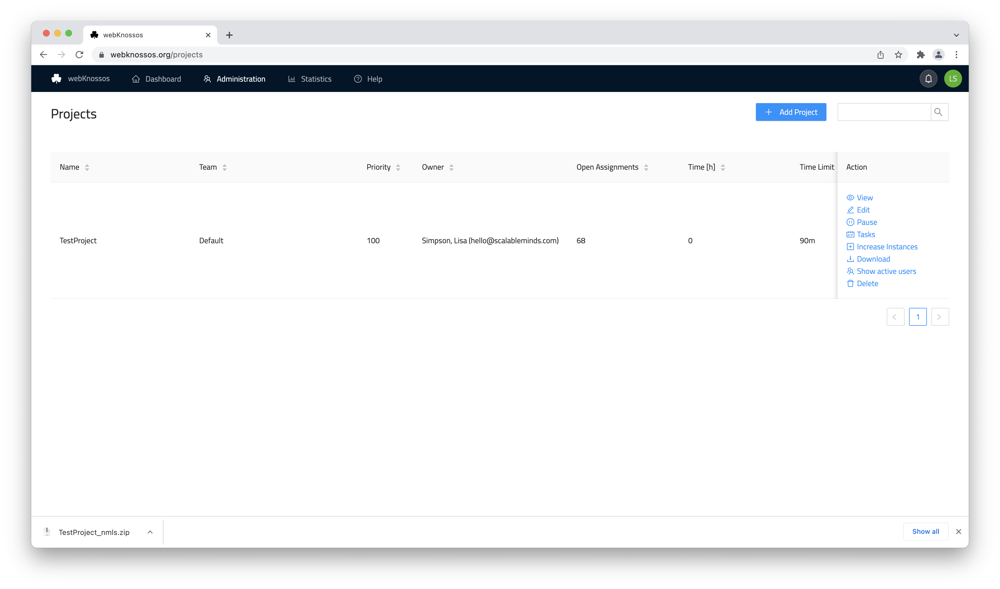

# Managing Tasks and Projects

webKnossos includes a powerful task and project management system to efficiently annotate large datasets. Large annotations can be broken down into smaller work pieces and distributed to members of your organization. 

## Concepts

- `Task`: Is an assignment for a small piece of work. A `Team Manager` or `Admin` creates Tasks with information about the Task Type, the referenced dataset, starting positions and advanced options. These tasks will be distributed to eligible users. 
- `Task Instance`: Some Tasks need to be completed redundantly by multiple users in order to assure quality. The single assignments of the tasks are called Instances.
- `Task Type`: Contains a blue print for Tasks. Includes information such as a description with instructions, allowed annotation modes, and advanced options.
- `Project`: A group of many related Tasks is called a Project. Projects have a priority assigned to them which affects the order of assignment to users. Projects may be paused and resumed in order to manage the user workloads.
- `Experience`: Admins and Team Managers can assign experience levels to users. Experiences are defined by a domain and a value, such as `flight-annotation` and `100`. Tasks specify the required experience level of a user.

It is possible to download all annotations that belong to either a Project or a Task Type for further processing.

## How To Create Tasks

First, a Task Type needs to be created.
Open the `Task Types` screen of the admin section and click on `Add Task Type`.
Fill out the form in order to create the Task Type.
Note that the `Description` field supports Markdown formatting.
If you don't have a sophisticated team structure, just select the [Organization Team](./users.md#organizations).

Next, you need to set up a Project.
Open the `Projects` screen of the admin section and click on `Add Project`.
Fill out the form in order to create the Project.
Note that you can assign a `Priority` to the Project.
A higher value means that Tasks from this Project will be more likely to be assigned to users.
With the `Time Limit` you can specify the expected completion time of a Task Instance.
There will be an email notification if users exceed this limit.

Now, you are ready to create Tasks.
Open the `Tasks` screen of the admin section and click on `Add Task`.
You can choose between a form for creating a single Task or an advanced interface for creating Tasks in bulk.
For beginners, the form is recommended.
Fill out the form in order to create the Task.
Enter the starting positions in the lower part of the form.
Alternatively, you can upload an NML file that contains nodes which will be used as starting positions.

!!!info
    Note that you need to specify required Experiences for a Task. Your Task can only be assigned if there are users that have the required Experience.

    You can assign an Experience to a user on the `Users` screen.

    

After your Task has been created, users can request Tasks in their dashboard.
If there are no other Tasks, they will get your Task assigned.
When they are done, the users will `Finish` their Task Instance.

Finally, collect the completed data from the `Projects` screen by downloading a ZIP file with all NML files.

## Task Assignment Criteria

- Available Tasks are assigned to users that have the required experience and are members of the specified Team
- Multiple Task Instances will be assigned to different users
- Tasks from Projects with high Priority are assigned first
- Tasks from paused Projects are not assigned at all
- If there are multiple Tasks with the same priority, they will be chosen at random

