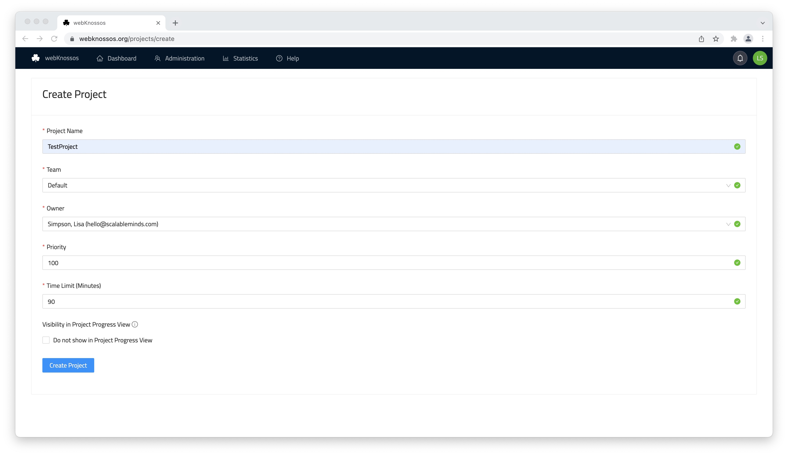

# Projects 

A group of many related Tasks is called a Project. Projects have a priority assigned to them which affects the order of assignment to users. Projects may be paused and resumed to manage the user workloads and priorities. 

## Creating a Project

To create a project, follow these steps:
1. Open the `Projects` screen of the administration section and click on `Add Project`.
2. Fill out the form to create the _Project_.
   - Note that you can assign a `Priority` to the Project. A higher value means that Tasks from this Project will be more likely to be assigned to users.
   - With the `Time Limit` property, you can specify the expected completion time of a Task Instance. There will be an email notification if users exceed this limit.

## Project progress and statistics

You can view your project's progress from your dashboard in the Statistics menu item, in the top bar. 

