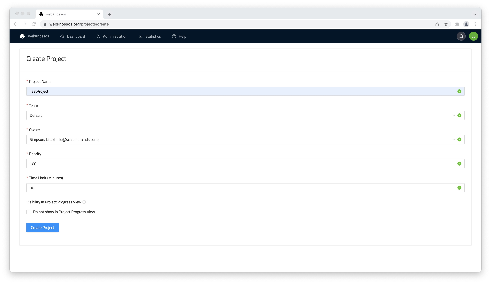

# Projects 

A group of many related Tasks is called a Project. Projects have a priority assigned to them which affects the order of assignment to users. Projects may be paused and resumed to manage the user workloads and priorities. 

## Creating a Project

To create a project, follow these steps:
1. Open the `Projects` screen of the administration section and click on `Add Project`.
2. Fill out the form to create the _Project_.
   - Note that you can assign a `Priority` to the Project. A higher value means that Tasks from this Project will be more likely to be assigned to users.
   - With the `Time Limit` property, you can specify the expected completion time of a Task Instance. There will be an email notification if users exceed this limit.

/// caption
Create a Project
///

## Project progress and statistics

You can view your project's progress from your dashboard in the Statistics menu item, in the top bar. 

### Project Progress View

The `Project Progress` report gives a compact overview across all projects of a selected team.

1. Select `Statistics > Project Progress` in the top navigation bar.
2. Pick a team in the filter section.
3. Click Search

The table includes:

- `Project`: Project name (paused projects are marked with a pause icon).
- `Tasks`: Number of tasks in the project.
- `Priority`: Current project priority used for task assignment.
- `Time [h]`: Total annotation time.
- `Instances`: A bar graph showing the total number of finished/active/pending task instances.

Notes:

- The view refreshes automatically in regular intervals and can also be refreshed manually.
- You can re-open the team filter panel at any time via the settings button.

### Time Tracking View

The `Annotation Time per User` report helps analyze workload and throughput per user.

1. Open `Statistics > Time Tracking` in the top navigation bar.
2. Configure filters to narrow the results:
   - Include only tasks from projects and/or all annotations
   - Teams
   - Date range

The report provides:

- Per-user totals for annotation/task count and tracked time.
- Average time per task/annotation.
- Expandable rows for detailed per-user time-tracking entries.
- CSV export for the current overview.
- Per-user CSV export of detailed time spans.

Tips:

- Start with a narrow date range and one team for faster analysis.
- Use the detailed per-user export when preparing quality reviews, audits, or billing reports.
