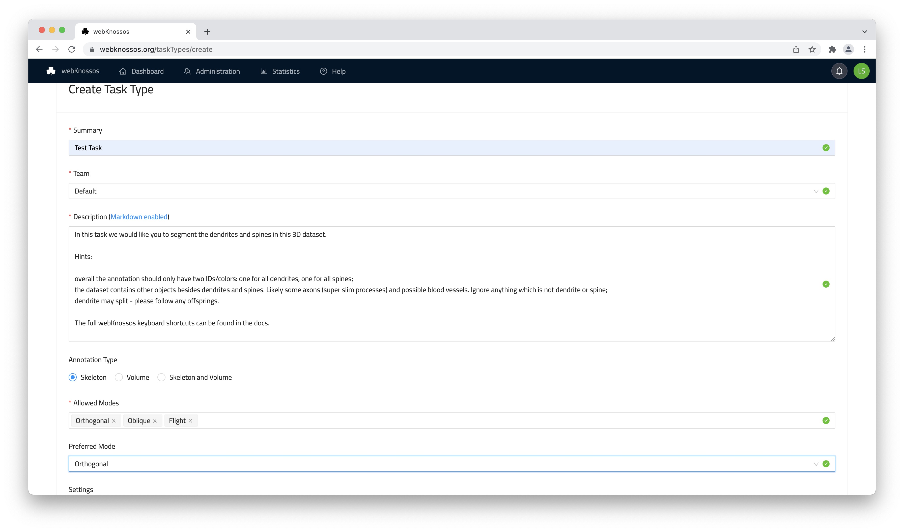
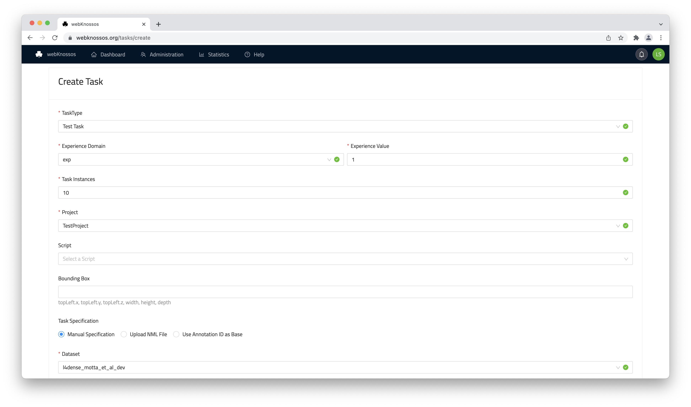
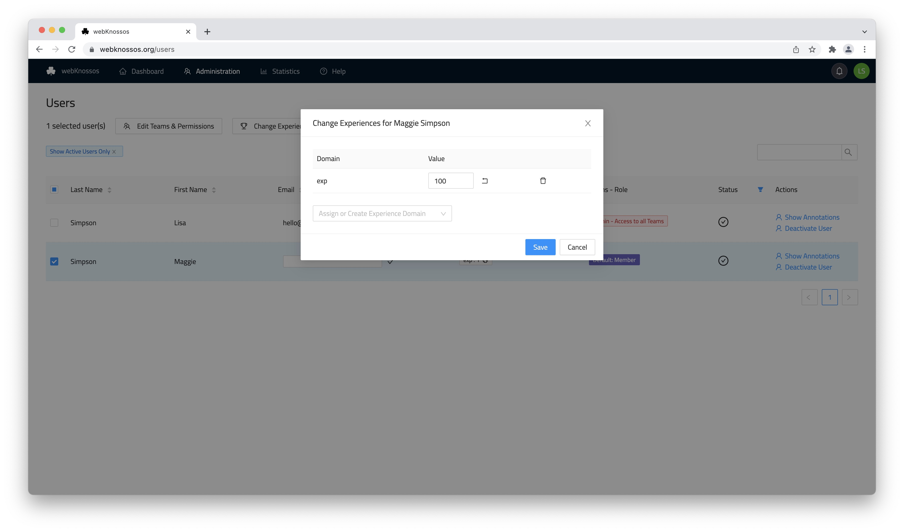
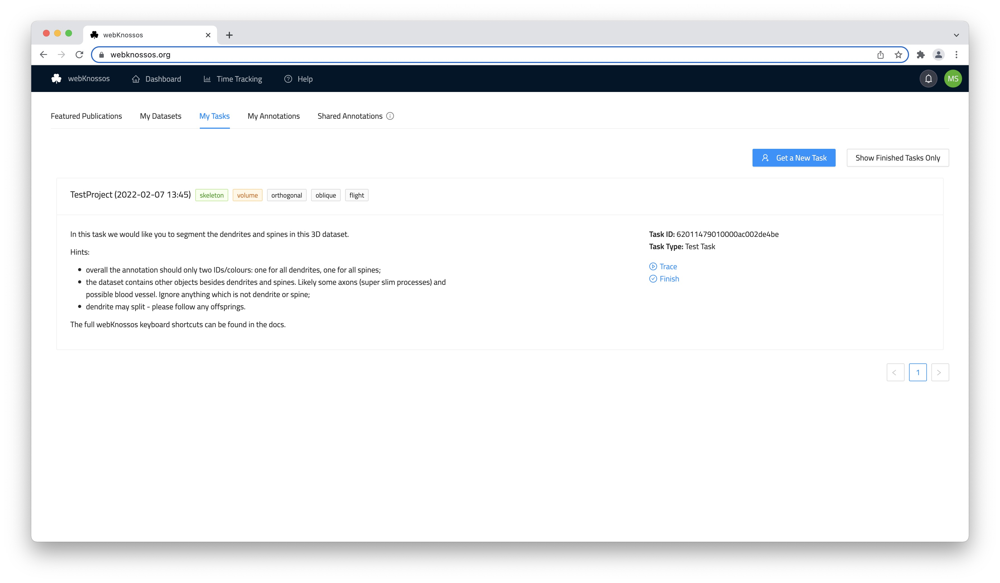
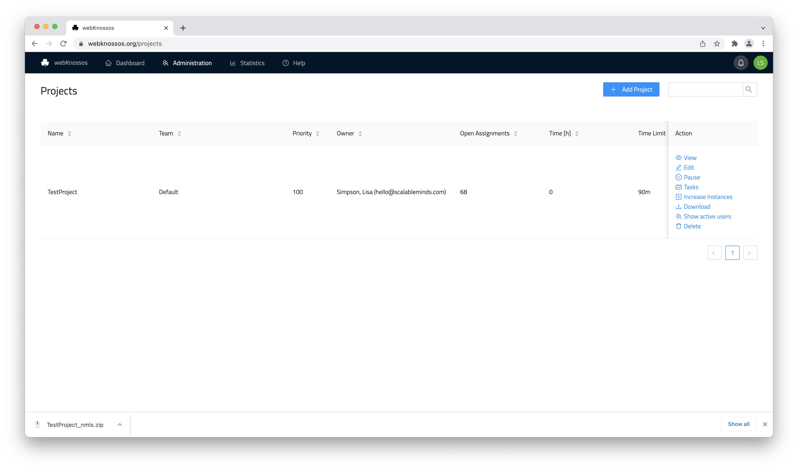
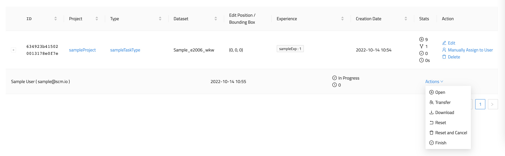

# Tasks

The task systems is designed for automated task distribution to a (large) group of annotators based on several criteria, e.g., experience, access rights, etc. For fine-grained control, manual task assignments are also possible.

## Creating a Task Type

First, a _Task Type_ needs to be created:

1. Open the `Task Types` screen of the administration section and click on `Add Task Type`.
2. Fill out the form to create the Task Type:
   - Note that the `Description` field supports Markdown formatting.
   - If you don't have a sophisticated team structure, select the [default Team](../users/organizations.md).
   - Take a look at the additional settings to configure the new _Task&nbsp;Type_:

??? settings
      | Display Name                              | Key                        | Default Value           | Comment                                 |
      |--------------------------------------------|----------------------------|------------------------|-----------------------------------------|
      | Clipping Distance                         | `clippingDistance`           | 80                     | orthogonal mode                         |
      | Move Value (nm/s)                         | `moveValue`                  | 500                    | orthogonal mode                         |
      | Show Scalebars                            | `displayScalebars`           | false                  |                                         |
      | Single-node-tree mode (Soma clicking)      | `newNodeNewTree`             | false                  |                                         |
      | Auto-center Nodes                         | `centerNewNode`              | true                   |                                         |
      | Plane Display Mode in 3D View              | `tdViewDisplayPlanes`        | WIREFRAME              | NONE or WIREFRAME or DATA               |
      | Display Dataset Borders in 3D View         | `tdViewDisplayDatasetBorders`| true                   |                                         |
      | Display Layer Borders in 3D View           | `tdViewDisplayLayerBorders`  | false                  |                                         |
      | d/f-Switching                             | `dynamicSpaceDirection`      | true                   |                                         |
      | Highlight Commented Nodes                  | `highlightCommentedNodes`    | false                  |                                         |
      | Override Node Radius                       | `overrideNodeRadius`         | true                   |                                         |
      | Particle Size                              | `particleSize`               | 5                      |                                         |
      | Keyboard delay (ms)                        | `keyboardDelay`              | 0                      |                                         |
      | Show Crosshairs                            | `displayCrosshair`           | true                   |                                         |
      | Classic Controls                           | `useLegacyBindings`          | false                  |                                         |
      | 4 Bit                                      | `fourBit`                    | false                  |                                         |
      | Interpolation                              | `interpolation`              | true                   |                                         |
      | Segmentation Opacity                       | `segmentationOpacity`        | 0                      |                                         |
      | Pattern Opacity                            | `segmentationPatternOpacity` | 40                     |                                         |
      | Zoom                                       | `zoom`                       | 0.8                    |                                         |
      | Render Missing Data Black                  | `renderMissingDataBlack`     | false                  |                                         |
      | Loading Strategy                           | `loadingStrategy`            | BEST_QUALITY_FIRST     | BEST_QUALITY_FIRST or PROGRESSIVE_QUALITY|
      | Clipping Distance                          | `clippingDistanceArbitrary`  | 60                     | flight/oblique mode                     |
      | Move Value (nm/s)                          | `moveValue3d`                | 600                    | flight/oblique mode                     |
      | Mouse Rotation                             | `mouseRotateValue`           | 0.001                  |                                         |
      | Keyboard Rotation                          | `rotateValue`                | 0.01                   |                                         |
      | Sphere Radius                              | `sphericalCapRadius`         | 500                    |                                         |
      | Brush Size                                 | `brushSize`                  | 50                     |                                         |

Next, you need to set up a [Project](../tasks_projects/projects.md). Once you have created your project, you are ready to create _Tasks_:

## Creating a Task

1. Open the `Tasks` screen of the administration section and click on `Add Task`.
2. Fill out the form create the Task.
   - Enter the starting positions in the lower part of the form.
   - Alternatively, you can upload an NML file that contains nodes that will be used as starting positions.

Tasks can also be created in bulk using the advanced CSV text input. Not recommended for beginners.

**Note that you need to specify required _Experiences_ for a _Task_. Your _Task_ can only be assigned if there are users that have the required _Experience_ assigned to them. You can assign an [Experience](../users/new_users.md) to a user on the `Users` screen.**

After your _Task_ is created, other users in your organization can request _Tasks_ from their dashboard (_Tasks_ tab).
If there are no other projects with high priorities, they will eventually get your _Task_ assigned.
Alternatively, you can manually assign a task to individual users (see below).
Once a user is done working on a task, they can mark the task as `Finished`.

Finally, you can collect and review the completed data of all annotations within a project:

1. Navigate to the `Project` page
2. Select to _View_ or _Download_ all the combined annotations.

## Automatic Task Assignment

When users request a new task from their dashboard ("Tasks" tab), a set of criteria is matched to assign them to a fitting task:

- Available _Tasks_ are assigned to users that have the required _Experience_ and are members of the specified team
- Multiple _Task_ Instances will be assigned to different users
- _Tasks_ from _Projects_ with high priority are assigned first
- _Tasks_ from paused _Projects_ are not assigned at all
- If there are multiple _Tasks_ with the same priority, they will be chosen at random

# User Experience Levels 
For a fine-grained assignment to [annotation tasks](../tasks_projects/tasks.md), each user can have one or more experience levels assigned to them. Based on their respective experience level, tasks may or may not be distributed to them.

Assign/Remove experience levels by selecting one/several users and clicking on the `Change Experience` button. In the pop-up window, you can select any existing experience from the dropdown or type the domain name of a new experience domain in the dropdown input. 

Each experience domain is combined with a numeric value indicating the proficiency of the respective user.  
E.g., a season annotator may have the experiences `nuclei: 10` and  `mitochondria: 7`, while a rookie could start at `nuclei: 1` to codify that he has not worked on mitochondria annotation at all and just started with his first nuclei reconstruction project. 

Experience domains are referenced during task type and project creation and task distributing respectively. 
Domain names and values are arbitrary and can be customized to make sense for your organization. 

## Manual Task Assignment

In contrast to the automated task distribution system, an admin user can also manually assign a task instance to users.
Note, manual assignments bypass the assignment criteria enforced by the automated system and allow for fine-grained and direct assignments to individual user.

Manual assignments can be done by:

1. Navigate to the task list
2. Search for your task by setting the appropriate filters
3. Click on "Manual Assign To User"
4. Select a user for the assignment from the dropdown
5. Confirm the assignment with "ok"

Existing, active and finished task instances can also be transferred to other users, e.g. for proofreading, continued annotation or to change ownership:

1. Navigate to the task list
2. Search for your task by setting the appropriate filters
3. Expand the list entry for selected task - plus icon - and locate the respective task instance
4. From the `Actions` menu on the right-hand side, select "Transfer"
5. Select a user for the task transferal from the dropdown
6. Confirm the task transfer with "ok"

