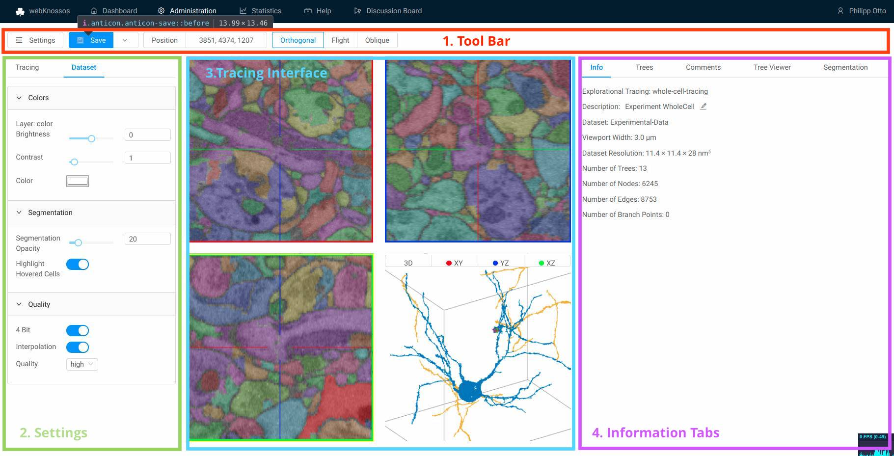
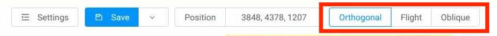

# Tracing UI

## Overview
The main webKnossos user interface for viewing and annotating datasets is divided into four sections.

1. A toolbar for general purposes features such as Saving your work and displaying the current position within the dataset spans along the full width on top of the screen. More below.
2. On the left-hand side, a settings menu gives the user control of several parameters of webKossso. For instance, one can fine-tune a dataset's contrast & segmentation opacity, as well as adjust movement speed of the mouse and keyboard. More below.
3. The center of the screen is occupied by the tracing interface. Your dataset is displayed here and users can add annotations or add/edit the segmentation. Most interactions we take place here. More below.
4. The right-hand side of the screen is occupied by several tabs providing more information on your current dataset or tracing. Depending on your editing mode these tabs might change. More below.

## The Toolbar
The toolbar contains frequently used commands, your current position within the dataset and the ability to switch between various modes for viewing and interaction with the dataset or tools depending on your tracing mode.

The most common buttons are:
- `Settings`: Toggles the visibility of the setting menu on the left-hand side to make more space for your data.
- `Undo` / `Redo`: Undoes the last operation or redoes it if now changes have been made in the meantime.
- `Save`: Saves your annotation work. wK automatically saves every 30 seconds.
- `Archive`: Only available for explorative tracings. Closes the tracing and archives it, removing it from a user's dashboard. Archived tracings can be found on a user's dashboard under "Explorative Tracings" and by clicking on "Show Archived Annotations". Use this to declutter your dashboard. 
- `Download`: Starts the download of the current annotation. Skeletontracings are downloaded as NML files. Volumetracing downloads contain the raw segmentation data as wkw files.
- `Share`: Create a shareable link to your dataset containing the current position, rotation, zoom level etc. Use this to collaboratively work with colleagues. Read more about this feature in the [Sharing guide](./sharing.md).  
- `Add Script`: Using the [wK frontend API](https://demo.webknossos.org/assets/docs/frontend-api/index.html) users can interact with wK programmatically. User script can be executed from here. Admins can add often used scripts to wK to make them available to all users for easy access.

A user can directly jump to positions within their datasets by entering them in the position input field. The same is true for the rotation in some tracing modes. Clicking on the position or rotation labels copies the values to the clipboard.

TODO Add image

## Skeleton Tracing
The goal for skeleton tracing is to reconstruct structures in a dataset that span across many data slices as a graph of connected nodes. A typical example of a skeleton tracing is to follow a blood vessel for a few centimeters, placing a node every few slices. (See image below)

A typical skeleton tracing contains the reconstruction of one or more structures often with many thousand nodes. All connected nodes form a tree or more generally speaking a graph.

Skeleton tracings can be downloaded, modified, imported using a human-readable XML-based file format called NML.

This article outlines the available features and operations for viewing, editing, or creating new skeleton tracings in webKnossos.

### Tracing Modes
webKnossos supports several modes for displaying your dataset & interacting with skeleton tracings.

#### Orthogonal Mode
Orthogonal mode displays a dataset orthogonally to each of the three main axis x, y, z. Additionally, a fourth viewport shows the data and skeleton from a 3D perspective. All camera movement happen along the main axis. This view is especially useful for viewing your data in the highest possible quality alongside its main imaging axis, typically XY. Every single slice of raw data can be viewed.

Most skeleton tracing operations and keyboard shortcuts are tailored for the Orthogonal Mode.

#### Flight Mode
Flight mode allows an arbitrary view through the data. In contrast to orthogonal mode, any arbitrary slice through the dataset at any rotational angle of the camera is possible. In Flight mode, the data is projected on the inside of a sphere with the camera located at the center of the sphere. 

Spherical projection is especially useful when rotating the camera, as pixels close to the center of the screen move in a predictable manner. Interaction and movements in flight mode feel similar to First-Person (FPV) games.

Flight mode is best used for annotating structures very quickly. Skill tracers can follow "tube"-like structure as though they were "flying" through them. Nodes are placed automatically along the flight path, creating skeleton very efficiently.

#### Oblique Mode
Oblique Mode is similar to Flight mode, but arbitrary cuts through the data are not projected on a sphere but are straight instead.

### Nodes and Trees
Skeleton tracings consist of connected nodes forming a graph. Nodes are connected through edges and are organized a trees. 

Nodes can be placed by right clicking in orthogonal mode or by automatically when moving in flight or oblique mode. webKnossos uses the concept of always having an active node and an active tree. All (global) operations are executed on the current active node, e.g. adding a comment or node deletion. Most keyboard shortcuts take the active node into context. Operations on whole trees, e.g. splitting or merging trees, follow the same pattern.

Skeleton tracing can contain one or many trees consiting of several nodes all the way to millions of nodes. Users can add comments to each node to mark important positions or easily select them from a list of comments for later usage. The `Tree Viewer` tab on the right-hand side menu displays a 2D simplified tree representation of the currently active tree.

Many organic structures do not follow a single, linear path but split into several individual branches instead. webKnossos natively supports branch points. Any node can be marked as a branch point using the keyboard shortcut "B". Branch points are highlighted using a slightly different color. All branch points are saved as a stack for each tree and can be accessed first-in, first-out (FIFO). Press the "J" to jump to the latest branch point to continue working from their and remove it from the stack.

| Keyboard Shortcut | Operation                 |
| ----------------- | -------------             |
| Right Click       | Create New Node           |
| S                 | Center Active Node        |
| DEL               | Delete Active Node        |
| B                 | Create Branch Point       |
| J                 | Jump to Last Branch Point |

All further keyboard shortcuts are [available here](./keyboard_shortcuts.md). 

### Tree Groups
- Rename, adding, delete
-  split / merge
- drag & drop
- hiding trees
- colors shuffeling

### Importing & Exporting NML Files
webKnossos makes it easy to import or export skeleton tracings as NML files. There are two ways for downloading your tracings:

1. There is a `Download` button in the overflow menu next to the prominent `Save` button in the toolbar at the top of the screen. 

2. If you need more fine-grained control over which trees to download use the `Download Selected Trees` option. Form the `Tree Tab` click on `More` and select `Download Selected Trees` from the menu. All visible trees (checkmark in front of the name) will be downloaded in as an NML file. This is especially useful if you need to only download a single tree of an otherwise much larger tracing.

Importing a skeleton tracing can be achieved using two approaches as well:

1. If you already have a tracing open you can easily add more skeletons to it by drag and dropping an NML file onto your browser window. Otherwise, use the `Import NML` option next to `Download Selected Trees`. This will merge the NML files content with the already open tracing. 

2. To import a skeleton tracing as a completely new wK annotation, navigate to your user dashboard. Under "Explorative Tracings" use the `Upload Annotation` button.

### Merging Tracings
There are two ways for merging tracings:

1. While in the tracing UI, drag and drop an NML file onto your browser window to import a skeleton. The imported skeleton will be merged with currently open tracing.

2. If you would like to merge your current tracing with another existing tracing, select the `Merge` operation from the overflow menu next to the `Save` button. (see image) Either enter the ID of an existing explorative tracing or select a whole project and proceed to merge the selection with your currently open tracing. The resulting annotation can either be created as a new explorative tracing. Otherwise, the merge will happen in your current tracing. 

## Volume Tracing
- what are volume tracings
- tools
  - brush, move, selection
- adding / deleting segmentation
- keyboard shortcuts
- segementation tab

## Tracing UI Settings
The settings menu allows users to fine-tune some parameters of webKnossos. All settings are automatically saved as part of a user's profile. 
The `Tracing` settings include options related to interacting with a dataset while annotating, e.g. mouse movement speed. Tracing settings only affect the currently open tracing and will be restored when reopening the tracing in the future.
The `Dataset` settings include options to manipulate the rendering of the dataset, e.g. brightness & contrast. Dataset settings effect all of the user's tracing referencing this particular dataset so that tracing can be created using the same conditions.

Not all settings are available in every tracing mode.

### Tracing Settings
Controls
- `Keyboard delay (ms)`: The initial delay before an operation will be executed when pressing a keyboard shortcut. A low value will immediately execute a keyboard's associated operation, whereas a high value will delay the execution of an operation. This is useful for preventing an operation being called multiple times when rapidly pressing a key in short succession, e.g. for movement.

- `Move Value (nm/s)`:  A high value will speed up movement through the dataset, e.g. when holding down the spacebar. Vice-versa, a low value will slow down the movement allowing for more precision. This setting is especially useful in `flight mode`.

- `d/f-Switching`: ¯\_(ツ)_/¯

Viewport Options / Flight Options
- `Zoom`: The zoom factor for viewing the dataset. A low value moves the camera really close to the data, showing many details. A high value, will you show more of the dataset but with fewer details and is great for getting an overview or moving around quickly.
- `Viewport Scale`: Increases / Decreases the size of dataset viewports in the center of the screen.
- `Clipping Distance`: The distance between 3D structures and the camera used for hiding ("clipping") structures. Use it to reduce the number of visible nodes in the viewports and declutter your screen.
- `Show Crosshairs`: Shows / Hides the crosshair overlay over the viewports.
- `Mouse Rotation`: Increases / Decreases the movement speed when using the mouse to rotate within the datasets. A low value rotates the camera slower for more precisie movements. A high value rotates the camera quicker for greater agility. 
- `Keyboard Rotation`: Increases / Decreases the movement speed when using the arrow keys on the keyboard to rotate within the datasets. A low value rotates the camera slower for more precisie movements. A high value rotates the camera quicker for greater agility. 
- `Crosshair Size`: Controls the size of the crosshair in flight mode.
- `Sphere Radius`: In flight mode, the data is projected on the inside of a sphere with the camera located at the center of the sphere. This option influences the radius of said sphere flattening / rounding the projected viewport. A low value will cause less curvature showing the detail with more detail and less distortion. A high value will show more data along the edges of the viewport. 

Nodes & Trees
- `Active Node ID`: Contains the active node's ID. Enter a valid node ID to quickly navigate to it within the dataset and set it active for future operations.
- `Active Tree ID`: Contains the active tree's ID. Enter a valid tree ID to quickly navigate to the last node of the tree and set it active for future operations.
- `Node Radius`: Controls the size of each individual node. Large values will create big nodes, small values create tiny nodes. Each node can have a different size. This is useful for annotations where node sizes have a meaning.
- `Particle Size`: Controls the minimum node size for all nodes. This will override nodes with a too small node radius.
- `Override Node Radius`: When toggled, overrides all individual node sizes. This allows to uniformly adjust the size of all nodes simultaneously.
- `Soma Clicking`: When active every mouse click (left mouse button), will create a new tree. Use this for annotations were highlighting/marking structures is more important than labeling connected structures, e.g. for marking all Somas in a dataset.
- `Highlight Commented Nodes`: When active, nodes that have a comment associated with them will be rendered with a slight board around them. This is useful for quickly identifying (important) nodes.

Other
- `Bounding Box`: Users can set a custom bounding box that will be displayed in all viewports. Useful for orientation when working in a specific area of a dataset. Format: minX, minY, minZ, width, height, depth
- `Display Planes in 3D View`: fToggles the visibility of the data layers in the 3D viewport. This is useful if you want to view your nodes or a large skeleton in the 3D view without them being covered by the data layers.

### Dataset Settings
For multi-layer datasets, each layer can be adjusted seperately. 

Colors
- `Brightness`: Increase / Decrease the brightness of the data layer.
- `Contrast`: Increase / Decrease the contrast of the data layer.
- `Color`: Every data layer can be colored to make them easily identifiable. By default, all layers have a white overlay, showing the true, raw black & white data.

Segmentation
- `Segmentation Opacity`: Increases / Decreases the opacity of the segmentation layer. A low value will make the segmentation almost transparent letting you see the underlaying data layers more clearly. A high value will make the segmentation opaque which is useful for adjusting and reviewing the exact fit of the segementation layer. Only possible if your dataset has a segementation layer.
- `Highlight Hovered Cells`: Toggles wether segmented cells will be highlighted in all viewports when hovering over them with the mouse cursor. Useful for identifiying the highlighted cell in across all viewports.

Quality
- `4 Bit`: Toggles data download form the server using only 4 Bit instead of 8 Bit for each pixel. Use this to reduce the amount of necessary internet bandwidth for wK. Useful for show casing data on the go over cellular networks, e.g 4G. 
- `Quality`: Adjusts the quality level used for data download from the server. "High" will load the original, unmodified data. "Medium" and "Low" will load a downsampled version of the data layer to reduce network traffic. Use this to reduce the amount of necessary internet bandwidth for wK.

