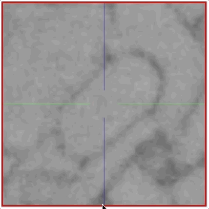

# Tracing UI

The main webKnossos user interface for viewing and annotating datasets is divided into four sections.

1. [A toolbar](#the-toolbar) for general purposes features such as Saving your work and displaying the current position within the dataset. It spans along the full width of the top of your screen.
2. On the left-hand side, a [settings menu](#tracing-ui-settings) gives you control of several parameters of webKosssos. For instance, you can fine-tune a dataset's contrast & segmentation opacity, as well as adjust movement speed of the mouse and keyboard.
3. The center of the screen is occupied by [the tracing interface](#skeleton-annotations). Your dataset is displayed here and users can add annotations or add/edit the segmentation. Most interactions will take place here.
4. The right-hand side of the screen is occupied by several tabs providing more information on your current dataset or annotation. Depending on your editing mode these tabs might adapt.

## The Toolbar
The toolbar contains frequently used commands, your current position within the dataset and the ability to switch between various modes for viewing and interaction with the dataset or tools depending on your tracing mode.

The most common buttons are:
- `Settings`: Toggles the visibility of the setting menu on the left-hand side to provide more space for your data.
- `Undo` / `Redo`: Undoes the last operation or redoes it if no new changes have been made in the meantime. Undo can only revert changes made in this session (since the moment the tracing view was opened). To revert to older versions use the "Restore Older Version" functionality, described later in this list.
- `Save`: Saves your annotation work. webKnossos automatically saves every 30 seconds.
- `Archive`: Only available for Explorative Annotations. Closes the annotation and archives it, removing it from a user's dashboard. Archived annotations can be found on a user's dashboard under "Explorative Annotations" and by clicking on "Show Archived Annotations". Use this to declutter your dashboard. 
- `Download`: Starts the download of the current annotation. Skeleton annotations are downloaded as [NML](./data_formats.md#nml) files. Volume annotation downloads contain the raw segmentation data as [WKW](./data_formats.md#wkw) files.
- `Share`: Create a shareable link to your dataset containing the current position, rotation, zoom level etc. Use this to collaboratively work with colleagues. Read more about this feature in the [Sharing guide](./sharing.md).  
- `Add Script`: Using the [webKnossos frontend API](https://webknossos.org/assets/docs/frontend-api/index.html) users can interact with webKnossos programmatically. User scripts can be executed from here. Admins can add often used scripts to webKnossos to make them available to all users for easy access.
- `Restore Older Version`: Opens a view that shows all previous versions of a tracing. From this view, any older version can be selected, previewed, and restored.

A user can directly jump to positions within their datasets by entering them in the position input field.
The same is true for the rotation in some tracing modes.
Clicking on the position or rotation labels copies the values to the clipboard.

## Skeleton Annotations
The goal of tracing skeletons is to reconstruct structures in a dataset that span across many data slices as a graph of connected nodes.
A typical example of a skeleton annotation is to follow a nerve cell for a few nanometers, placing a node every few slices. (See image below)

A typical skeleton annotation contains the reconstruction of one or more structures, often with many thousand nodes.
All connected nodes form a tree or more generally speaking a graph.

Skeleton annotations can be downloaded, modified, imported using a human-readable XML-based file format called [NML](./data_formats.md#nml).

This article outlines commonly used features and operations for viewing, editing, or creating new skeleton annotations in webKnossos.

### Tracing Modes
webKnossos supports several modes for displaying your dataset & interacting with skeleton annotations.

#### Orthogonal Mode
Orthogonal mode displays a dataset with the camera oriented orthogonally to each of the three main axis x, y, z.
Additionally, a fourth viewport shows the data and skeletons from a 3D perspective.
All camera movements happen along the respective main axis.
This view is especially useful for viewing your data in the highest possible quality alongside its main imaging axis, typically XY.
Every single slice of the raw data can be viewed.

Most skeleton tracing operations and keyboard shortcuts are tailored for the Orthogonal Mode.

#### Oblique Mode

Oblique mode presents an arbitrarily-resliced view through the data.
In contrast to Orthogonal mode, any arbitrary slice through the dataset at any rotational angle of the camera is possible.

#### Flight Mode
Flight mode also allows a resliced view through the data.
In contrast to Oblique mode, the data is projected on the inside of a sphere with the camera located at the center of the sphere.

Spherical projection is especially useful when rotating the camera, as pixels close to the center of the screen move in a predictable manner.
Interactions and movements in Flight mode feel similar to First-Person-View (FPV) games.

Flight mode is best used for annotating structures very quickly.
Trained tracers can follow "tube"-like structures as though they are "flying" through them.
Nodes are placed automatically along the flight path, creating skeleton very efficiently.

### Nodes and Trees
Skeleton annotations consist of connected nodes forming a graph.
Nodes are connected through edges and are organized in trees.

Nodes can be placed by right-clicking (*Right Click*) in orthogonal mode or automatically when moving in flight or oblique mode.
webKnossos uses the concept of always having an active node and an active tree.
All (global) operations are executed on the current active node, e.g. adding a comment or node deletion.
Most keyboard shortcuts take the active node into context.
Operations on whole trees, e.g. splitting or merging trees, follow the same pattern.

Skeleton annotations can contain one or many trees consisting of several nodes all the way to millions of nodes.
Users can add comments to each node to mark important positions or easily select them from a list of comments for later usage.
Comments are organized in the `Comments` tab on the right-hand side of the screen.
The `Tree Viewer` tab on the right-hand side menu displays a 2D simplified tree representation of the currently active tree.

Many organic structures do not follow a single, linear path but split into several individual branches instead.
webKnossos natively supports branch points.
Any node can be marked as a branch point using the keyboard shortcut "B".
Branch points are highlighted using a slightly different color.
All branch points are saved as a stack for each tree and can be accessed first-in, first-out (FIFO).
Press the "J" to jump to the latest branch point to continue working from there and remove it from the stack.

| Key Binding       | Operation                           |
| ----------------- | -------------                       |
| Right Click       | Create New Node                     |
| SHIFT + Left Click| Select Node (Mark as Active Node)   |
| S                 | Center Camera on Active Node        |
| DEL               | Delete Active Node                  |
| B                 | Create Branch Point                 |
| J                 | Jump to Last Branch Point           |
| C                 | Create New Tree                     |

All further keyboard shortcuts are [available here](./keyboard_shortcuts.md).

### Tree Operations & Tree Groups
All operations and information regarding trees are organized under a tab called `Trees` on the right-hand side of the screen.

A typical skeleton annotation consists of one or more trees.
Trees can be nested and organized in so-called `Tree Groups`.
Tree groups can have a name and are used to structure and label your annotation even further.
Trees can be dragged and dropped between tree groups. This action can be applied to multiple trees by selecting them with Ctrl + Left Mouse. 
Hover over existing tree groups to bring up a little menu for creating new groups and deletion. Renaming of a group can be done by selecting a group and then entering the new name into the input above the tree hierarchy structure view.

#### Merging / Splitting Trees
Common tree operations include splitting and merging trees.

- `Tree splitting` can be done in two ways: 
  1. Select a node at which to split (*SHIFT + Left Click*) and delete (*DEL*) it.
  2. Delete an edge between two nodes. Select the first node (*SHIFT + Left Click*), then *SHIFT + CTRL + Left Click* on the second node of the edge to delete this connection.
- `Tree merging` works similarly to edge deletion but will create a new edge between two previously unconnected trees. Select the first node and *SHIFT + ALT + Left Click* the second node to create an edge between the two.

#### Tree Colors
A random color is assigned to each tree upon creation.
Colors can be shuffled for a single tree or for all trees in a skeleton.
Use the overflow menu under `More` in the tree tab and select `Change Color` or `Shuffle All Colors` to assign new randomly chosen colors.
All node have the same color as their parent tree and can not be changed individually.
The active node, branch points, and node that have comments assigned to them are highlighted with a slight variation of the tree's color.

#### Tree Visibility
The visibility of individual trees can be toggled to hide some trees for a better overview.
Toggle the checkbox before each tree name or tree group to hide/show it.
Alternatively, the visibility of all trees can be toggled all at once using the `Toggle All` / `Toggle Inactive` button under the `Tree Tab`.
There are also keyboard shortcuts to quickly toggle the visibility:

| Key Binding                 | Operation                             |
| ----------------------------| -------------                         |
| 1                           | Toggle Visibility of all Trees        |
| 2                           | Toggle Visibility of Inactive Trees   |
| SHIFT + ALT + Left Click    | Merge Two Nodes and Combine Trees     |
| SHIFT + CTRL + Left Click   | Delete Edge / Split Trees             |

### Importing & Exporting NML Files
webKnossos makes it easy to import or export skeleton annotations as [NML files](./data_formats.md#nml).
There are two ways for downloading your annotations:

1. There is a `Download` button in the overflow menu next to the prominent `Save` button in the toolbar at the top of the screen. 

2. If you need more fine-grained control over which trees to download use the `Download Selected Trees` option. From the `Trees Tab` click on `More` and select `Download Selected Trees` from the menu. All visible trees (checkmark in front of the name) will be downloaded as an NML file. This is especially useful if you need to only download a single tree of an otherwise much larger tracing.

Importing a skeleton annotation can be achieved using two approaches as well:

1. If you already have an annotation open you can easily add more skeletons to it by **drag and dropping** an NML file onto your browser window. Otherwise, use the `Import NML` option next to `Download Selected Trees`. This will merge the NML file's content with the already open annotation. 

2. To import a skeleton annotation as a completely new webKnossos annotation, just drag and drop the NML file anywhere on your user dashboard. Alternately, navigate to your user dashboard and use the `Upload Annotation` button within the "Explorative Annotations" section.

### Merging Skeleton Annotations
There are two ways for merging annotations:

1. While in the tracing UI, **drag and drop** an NML file onto your browser window to import a skeleton. The imported skeleton will be merged with currently open annotation.

2. If you would like to merge your current annotation with another existing annotation, select the `Merge` operation from the overflow menu next to the `Save` button. (see image) Either enter the ID of an existing explorative annotation or select a whole project and proceed to merge the selection with your currently open annotation. The resulting annotation can either be created as a new explorative annotation. Otherwise, the merge will happen in your current annotation. 

## Volume Annotations

In addition to skeleton annotations, webKnossos also supports volume annotations.
In this type of annotation, you can label groups of voxels with efficient drawing tools.

### Tools
Select one of the drawing tools from the toolbar or toggle through with the keyboard shortcut *W*.

- `Move`: Navigate around the dataset.
- `Trace`: Draw outlines around the voxel you would like to label.
- `Brush`: Draw over the voxels you would like to label. Adjust the brush size with *SHIFT + Mousewheel*.

Add labels with *Left Mouse Drag*.
Remove labels with *Right Mouse Drag*.

In the `Segmentation` tab on the right-hand side, you can see the cell IDs which are active, below your cursor, or in the middle of the viewport.

### Merging Segments

Segments from e.g. automatic segmentations can be merged with the merger mode to refine the result. The merger mode is available in skeleton and hybrid tracings. Each tree represents a merged segment and its nodes define the segments that are merged together. So each new merged segment needs its own tree. The merger mode can be enabled in the settings in the category Nodes & Trees under the option Enable Merger Mode. As soon as you enable it, all already existing trees will be used to form merged segments.

## Hybrid Annotations

Hybrid annotations combine the functionality of skeleton and volume annotations.
In this type of annotation, you can, for example, use a guiding skeleton to support volume annotation tasks.
Alternatively, comments, that are usually only supported in skeleton annotations, could be used to label specific cells.

Skeleton or Volume annotations can be converted to hybrid annotations, by clicking the `Convert to Hybrid` button in the info tab.
This conversion cannot be reversed.

## Tracing UI Settings
The settings menu allows users to fine-tune some parameters of webKnossos.
All settings are automatically saved as part of a user's profile.
The `Tracing` settings include options related to interacting with a dataset while annotating, e.g. mouse movement speed.
Tracing settings only affect the currently open annotation and will be restored when reopening the respective annotation in the future.
The `Dataset` settings include options to adjust the rendering of the dataset, e.g. brightness & contrast.
Dataset settings affect all of the user's annotations referencing this particular dataset so that tracings can be created using the same conditions.

Not all settings are available in every tracing mode.

### Tracing Settings
#### Controls
- `Keyboard delay (ms)`: The initial delay before an operation will be executed when pressing a keyboard shortcut. A low value will immediately execute a keyboard's associated operation, whereas a high value will delay the execution of an operation. This is useful for preventing an operation being called multiple times when rapidly pressing a key in short succession, e.g. for movement.

- `Move Value (nm/s)`:  A high value will speed up movement through the dataset, e.g. when holding down the spacebar. Vice-versa, a low value will slow down the movement allowing for more precision. This setting is especially useful in `Flight mode`.

- `d/f-Switching`: If d/f switching is disabled, moving through the dataset with `f` will always go *f*orward by *increasing* the coordinate orthogonal to the current slice. Correspondingly, `d` will backwards by decreasing that coordinate. However, if d/f is enabled, the meaning of "forward" and "backward" will change depending on how you create nodes. For example, when a node is placed at z == 100 and afterwards another node is created at z == 90, z will be *decreased* when going forward.

#### Viewport Options / Flight Options
- `Zoom`: The zoom factor for viewing the dataset. A low value moves the camera really close to the data, showing many details. A high value, will you show more of the dataset but with fewer details and is great for getting an overview or moving around quickly.
- `Viewport Scale`: Increases / Decreases the size of dataset viewports in the center of the screen.
- `Clipping Distance`: The distance between 3D structures and the camera used for hiding ("clipping") structures. Use it to reduce the number of visible nodes in the viewports and declutter your screen.
- `Show Crosshairs`: Shows / Hides the crosshair overlay over the viewports.
- `Mouse Rotation`: Increases / Decreases the movement speed when using the mouse to rotate within the datasets. A low value rotates the camera slower for more precise movements. A high value rotates the camera quicker for greater agility. 
- `Keyboard Rotation`: Increases / Decreases the movement speed when using the arrow keys on the keyboard to rotate within the datasets. A low value rotates the camera slower for more precise movements. A high value rotates the camera quicker for greater agility. 
- `Crosshair Size`: Controls the size of the crosshair in flight mode.
- `Sphere Radius`: In flight mode, the data is projected on the inside of a sphere with the camera located at the center of the sphere. This option influences the radius of said sphere flattening / rounding the projected viewport. A high value will cause less curvature showing the detail with more detail and less distortion. A low value will show more data along the edges of the viewport. 

#### Nodes & Trees
- `Active Node ID`: Contains the active node's ID. Enter a valid node ID to quickly navigate to it within the dataset and set it active for future operations.
- `Active Tree ID`: Contains the active tree's ID. Enter a valid tree ID to quickly navigate to the last node of the tree and set it active for future operations.
- `Node Radius`: Controls the size of each individual node. Large values will create big nodes, small values create tiny nodes. Each node can have a different size. This is useful for annotations where node sizes have a meaning.
- `Particle Size`: Controls the minimum node size for all nodes. This will override nodes with a too small node radius.
- `Override Node Radius`: When toggled, overrides all individual node sizes. This allows to uniformly adjust the size of all nodes simultaneously.
- `Soma Clicking`: When active every mouse click (*Left Click*), will create a new tree. Use this for annotations were highlighting/marking structures is more important than labeling connected structures, e.g. for marking all Somas in a dataset.
- `Highlight Commented Nodes`: When active, nodes that have a comment associated with them will be rendered with a slight board around them. This is useful for quickly identifying (important) nodes.

#### Volume Options
- `Brush Size`: The current size of the brush drawing tool.
- `Active Cell ID`: Contains the active cell's ID. Enter a valid cell ID to label voxels with this cell ID.

#### Other
- `Bounding Box`: Users can set a custom bounding box that will be displayed in all viewports. Useful for orientation when working in a specific area of a dataset. Format: minX, minY, minZ, width, height, depth
- `Display Planes in 3D View`: Toggles the visibility of the data layers in the 3D viewport. This is useful if you want to view your nodes or a large skeleton in the 3D view without them being covered by the data layers.

### Dataset Settings
For multi-layer datasets, each layer can be adjusted separately. 

#### Colors
- `Brightness`: Increase / Decrease the brightness of the data layer.
- `Contrast`: Increase / Decrease the contrast of the data layer.
- `Opacity`: Increase / Decrease the opacity of the data layer.
- `Color`: Every data layer can be colored to make them easily identifiable. By default, all layers have a white overlay, showing the true, raw black & white data.
- `Visibility`: Use the eye icon on the right side of the name of the data layer to toggle its visibility.

#### Segmentation
- `Segmentation Opacity`: Increases / Decreases the opacity of the segmentation layer. A low value will make the segmentation almost transparent letting you see the underlying data layers more clearly. A high value will make the segmentation opaque which is useful for adjusting and reviewing the exact fit of the segmentation layer. Only possible if your dataset has a segmentation layer.
- `Highlight Hovered Cells`: Toggles whether segmented cells will be highlighted in all viewports when hovering over them with the mouse cursor. Useful for identifying the highlighted cell in across all viewports.
- `Render Isosurfaces`: When activated, isosurfaces are rendered in the 3D viewport when clicking on a cell with Shift+Click. See [here](./mesh_visualization.md#live-isosurface-generation) for more information.

#### Quality
- `Quality`: Adjusts the quality level used for data download from the server. "High" will load the original, unmodified data. "Medium" and "Low" will load a downsampled version of the data layer to reduce network traffic. Use this to reduce the amount of necessary internet bandwidth for webKnossos.
- `Loading Strategy`: You can choose between two different loading strategies. When using "best quality first" it will take a bit longer until you see data, because the highest quality is loaded. Alternatively, "Progressive quality" can be chosen which will improve the quality progressively while loading. As a result, initial data will be visible faster, but it will take more time until the best quality is shown.
- `4 Bit`: Toggles data download from the server using only 4 Bit instead of 8 Bit for each pixel. Use this to reduce the amount of necessary internet bandwidth for webKnossos. Useful for showcasing data on the go over cellular networks, e.g 3G.
- `Interpolation`: When interpolation is enabled, bilinear filtering is applied while rendering pixels between two voxels. As a result, data may look "smoother" (or blurry when being zoomed in very far). Without interpolation, data may look more "crisp" (or pixelated when being zomed in very far).
- `Render Missing Data Black`: If a dataset doesn't contain data at a specific position, webKnossos can either render "black" at that position or it can try to render data from another magnification.

