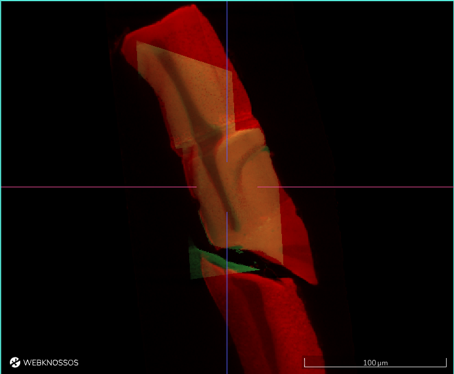
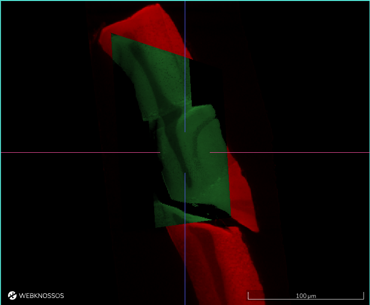

# Understanding the User Interface

The main WEBKNOSSOS user interface for viewing and annotating datasets is divided into five sections:

1. A toolbar for general purposes features such as Saving your work and displaying the current position within the dataset. Further, it provides access to all the tools for annotating and manipulating your data. It spans along the full width of the top of your screen.
2. The left-hand side panel provides a list of all available data, segmentation, and annotation layers as well as a settings menu for viewport options and keyboard controls.
3. The center of the screen is occupied by the annotation interface. Your dataset is displayed here, and you navigate and annotate it as desired. Most interactions will take place here.
4. The right-hand side panel is occupied by several tabs providing more information on your current dataset, skeleton/volume annotations, and other lists. Depending on your editing mode these tabs might adapt.
5. The bottom of the screen is covered by a status bar showing context-sensitive hints for mouse controls as well as additional information on mouse hover.

Read More About [Skeleton Annotation](./skeleton_annotation.md)

Read More About [Volume Annotation](./volume_annotation.md)

## The Toolbar

The toolbar contains frequently used commands, such as saving and sharing, your current position within the dataset, and the ability to switch between various modes for viewing. Further, it provides access to all the tools for annotation, navigation, and more.

The most common buttons are:

- `Undo` / `Redo`: Undoes the last operation or redoes it if no new changes have been made in the meantime. Undo can only revert changes made in this session (since the moment the annotation view was opened). To revert to older versions use the "Restore Older Version" functionality described later in this list.
- `Save`: Saves your annotation work. WEBKNOSSOS automatically saves every 30 seconds.
- `Menu`: 
  - `Archive`: Closes the annotation and archives it, removing it from a user's dashboard. Archived annotations can be found on a user's dashboard under "Annotations" and by clicking on "Show Archived Annotations". Use this to declutter your dashboard. (Not available for tasks)
  - `Download`: Starts a download of the current annotation including any skeleton and volume data. Skeleton annotations are downloaded as [NML](./data_formats.md#nml) files. Volume annotation downloads contain the raw segmentation data as [WKW](./data_formats.md#wkw) files.
  - `Share`: Create a customizable, shareable link to your dataset containing the current position, rotation, zoom level etc. with fine-grained access controls. Use this to collaboratively work with colleagues. Read more about [data sharing](./sharing.md).
  - `Duplicate`: Create a duplicate of this annotation. The duplicate will be created in your account, even if the original annotation belongs to somebody else.
  - `Screenshot`: Takes a screenshot of current datasets/annotation from each of the three viewports and downloads them as PNG files.
  - `Create Animation`: Creates an eye-catching animation of the dataset as a video clip. [Read more about animations](./animations.md).
  - `Merge Annotations`: Combines the skeletons and segments from one or more individual annotations into a new annotation.
  - `Add Script`: Using the [WEBKNOSSOS frontend API](https://webknossos.org/assets/docs/frontend-api/index.html) users can script and automate WEBKNOSSOS interactions. Enter and execute your user scripts (Javascript) from here. Admins can curate a collection of frequently used scripts for your organization and make them available for quick selection to all users.
  - `Restore Older Version`: Opens a window that shows all previous versions of an annotation. WEBKNOSSOS keeps a complete version history of all your changes to an annotation (separate for skeleton/volume). From this window, any older version can be selected, previewed, and restored.
  - `Layout`: The WK annotation user interface can be resized, reordered, and customized to suite your workflows. Use the mouse to drag, move and resize any viewport. You can safe these layout arrangements or restore the default viewport state.
- `Quick Share`: Create a shareable link to your dataset containing the current position, rotation, zoom level etc. Use this to collaboratively work with colleagues. Read more about [data sharing](./sharing.md).
- `AI Analysis`: Starts an AI segmentation of the datasets. Choose between several automated analysis workflows. Read more about [AI analysis](./automated_analysis.md).

A user can directly jump to any position within their datasets by entering them in the position input field.
The same is true for the camera rotation in flight/oblique modes.
Clicking on the position or rotation labels copies the values to the clipboard.

The toolbar further features all available navigation and annotation tools for quick access:

- `Move`: Navigate around the dataset.
- `Skeleton`: Create skeleton annotations and place nodes. [Read more about skeleton annotations](./skeleton_annotation.md#tools).
- `Trace`: Creates volume annotations by drawing outlines around the voxels you would like to label. [Read more about volume annotations](./volume_annotation.md#tools).
- `Brush`: Creates volume annotations by drawing over the voxels you would like to label.
- `Erase (Trace/Brush)`: Removes voxels from a volume annotation by drawing over the voxels you would like to erase.
- `Fill Tool`: Flood-fills the clicked region with a volume annotation until it hits the next segment boundary (or the outer edge of your viewport). Used to fill holes in a volume annotation or to relabel a segment with a different id.
- `Segment Picker`: Select the volume annotation ID of a segment to make it the active cell id to continue labeling with that ID/color.
- `Bounding Box`: Creates and resizes any bounding box. See also the [Bounding Box (BB) panel](./tracing_ui.md#right-hand-side-panel) below.
- `Measurement Tool`: Measure distances between structures or the surface areas of segments by placing waypoints with the mouse.

Please see the detailed documentation on [skeleton](./skeleton_annotation.md#tools) and [volume annotation](./volume_annotation.md#tools) tools for a for explanation of all context-sensitve modifiers that are available to some tools.

## Layers and Settings

The left-hand side panel features both a list of all available data and annotation layers as well as settings menu to fine-tune some parameters of WEBKNOSSOS.
All settings are automatically saved as part of a user's profile.

### Layers Tab

Each dataset consists of one or more data and annotation layers. A dataset typically has at least one `color` layer containing the raw microscopy/etc image. Additional layers can include segmentations, skeleton and volume annotations. Each layer has several settings to adjust the viewing experience:

#### Histogram & General Layer Properties

- `Histogram`: The Histogram displays sampled color values of the dataset on a logarithmic scale. The slider below the Histogram can be used to adjust the dynamic range of the displayed values. In order to increase the contrast of data, reduce the dynamic range. To decrease the contrast, widen the range. In order to increase the brightness, move the range to the left. To decrease the brightness, move the range to the right.
  Above the histogram, there is a three-dots context menu with more options to further adjust the histogram or otherwise interact with the layer:

      - `Edit histogram range`: Manipulate the min/max value of the histogram range. Clips values above/below these limits.
      - `Clip histogram`: Automatically adjust the histogram for best contrast and brightness. Contrast estimation is based on the data currently available in your viewport. This is especially useful for light microscopy datasets saved as `float` values.
      - `Reload from server`: Reload the layer data from server. Useful if the raw data has been changed on disk and you want to refresh your current session.
      - `Jump to data`: Navigates the WEBKNOSSOS camera to the center position within the dataset where there is data available for the respective layer. This is especially useful for working with smaller layers - likely segmentations - that might not cover the whole dataset and are hard to find manually.

- `Opacity`: Increase / Decrease the opacity of a layer. 0% opacity makes a layer invisible. 100% opacity makes it totally opaque. Useful for overlaying several layers above one another.
- `Gamma Correction`: Increase / Decrease the luminance, brightness and contrast of a layer through a non-linear gamma correction. Low values darken the image, high values increase the perceived brightness. (Color layers only.)
- `Visibility`: Use the eye icon on the left side of layer name to enable/disable it. Toggling the visibility of a layer, is often the quickest way to make information available in the dataset or hide to get an overview.
  Disabling the visibility, unloads/frees these resources from your GPU hardware and can make viewing larger datasets more performant. Also, depending on your GPU hardware, there is a physical upper limit for how many layers - typically 16 or more - can be displayed at any time (WebGL limitation). Toggle layers as needed to mitigate this.

#### Color and Segmentation Layers

In addition to the general layer properties mentioned above, `color` and `segmentation` layers come with a number of other settings:

- `Color`: Every `color` layer can be re-colored to make it easily identifiable. By default, all layers have a white overlay, showing the true, raw black & white data. Clicking on the square color indicator brings up your system's color palette to choose from. Note, there is an icon button for inverting all color values in this layer.
- `Pattern Opacity`: Adjust the visibility of the texture/pattern on each segment. To make segments easier to distinguish and more unique, a pattern is applied to each in addition to its base color. 0% hides the pattern. 100% makes the pattern very prominent. Great for increasing the visual contrast between segments.
- `ID Mapping`: WEBKNOSSOS supports applying pre-computed agglomerations/groupings of segmentation IDs for a given segmentation layer. This is a very powerful feature to explore and compare different segmentation strategies for a given segmentation layer. Mappings need to be pre-computed and stored together with a dataset for WEBKNOSSOS to download and apply. [Read more about this here](./volume_annotation.md#mappings--on-demand-agglomeration).

#### Skeleton Annotation Layer

The skeleton annotation layer contains any trees that you add to your dataset. You can quickly toggle the visibility of all skeleton annotations by enabling/disabling this layer.

- `Node Radius`: Controls the size property of each node. Large values will render big nodes, small values create tiny nodes. Each node can have a different size. This is useful for annotations where node sizes encode a meaning.
- `Particle Size`: Controls the minimum node size for all nodes. This will globally override nodes falling below this node radius threshold. Used together with the `Override Node Radius` below.
- `Clipping Distance`: The distance between 3D structures and the camera used for hiding ("clipping") structures. Use it to reduce the number of visible nodes in the viewports and declutter your screen.
- `Override Node Radius`: When toggled, globally overrides all individual node sizes. This allows to uniformly adjust the size of all nodes simultaneously. Used together with the `Particle Size` setting.
- `Auto-center Nodes`: Per default, each time you place a node in a skeleton annotation, the WEBKNOSSOS viewport will center on this node. Disable, if you do not want the viewport to move/reposition while clicking nodes.
- `Highlight Commented Nodes`: When active, nodes that have a comment associated with them will be rendered with a slight board around them. This is useful for quickly identifying (important) nodes.

### Settings Tab

Note, not all control/viewport settings are available in every annotation mode.

#### Controls

- `Keyboard delay (ms)`: The initial delay before an operation will be executed when pressing a keyboard shortcut. A low value will immediately execute a keyboard's associated operation, whereas a high value will delay the execution of an operation. This is useful for preventing an operation being called multiple times when rapidly pressing a key in short succession, e.g., for movement.

- `Move Value (nm/s)`: A high value will speed up movement through the dataset, e.g., when holding down the spacebar. Vice-versa, a low value will slow down the movement allowing for more precision. This setting is especially useful in `Flight mode`.

- `d/f-Switching`: If d/f switching is disabled, moving through the dataset with `f` will always go *f*orward by _increasing_ the coordinate orthogonal to the current slice. Correspondingly, `d` will move backwards by decreasing that coordinate. However, if d/f is enabled, the meaning of "forward" and "backward" will change depending on how you create nodes. For example, when a node is placed at z == 100 and afterwards another node is created at z == 90, z will be _decreased_ when going forward.

- `Classic Controls`: Disabled by default to provide the best WEBKNOSSOS user experience. When enabled, several keyboard shortcuts and mouse interactions change to maintain backward compatibility for long-time users. See also the section on [Classic Keyboard Controls](./keyboard_shortcuts.md#Classic_Controls).

#### Viewport Options / Flight Options

- `Zoom`: The zoom factor for viewing the dataset. A low value moves the camera really close to the data, showing many details. A high value, will you show more of the dataset but with fewer details and is great for getting an overview or moving around quickly.
- `Show Crosshairs`: Shows / Hides the crosshair overlay over the viewports.
- `Show Scalebars`: Shows / Hides the scale bars overlay over the viewports.
- `Mouse Rotation`: Increases / Decreases the movement speed when using the mouse to rotate within the datasets. A low value rotates the camera slower for more precise movements. A high value rotates the camera quicker for greater agility.
- `Keyboard Rotation`: Increases / Decreases the movement speed when using the arrow keys on the keyboard to rotate within the datasets. A low value rotates the camera slower for more precise movements. A high value rotates the camera quicker for greater agility.
- `Crosshair Size`: Controls the size of the crosshair in flight mode.
- `Sphere Radius`: In flight mode, the data is projected on the inside of a sphere with the camera located at the center of the sphere. This option influences the radius of said sphere flattening / rounding the projected viewport. A high value will cause less curvature showing the detail with more detail and less distortion. A low value will show more data along the edges of the viewport.
- `Logo in Screenshots`: Enable or disabled the WEBKNOSSOS watermark when [taking screenshots](./tracing_ui.md#the-toolbar).

#### Data Rendering

- `Hardware Utilization`: Adjusts the quality level used for rendering data. Changing this setting influences how many data is downloaded from the server as well as how much pressure is put on the user's graphics card. Tune this value to your network connection and hardware power. After changing the setting, the page has to be refreshed.
- `Loading Strategy`: You can choose between two different loading strategies. When using "best quality first" it will take a bit longer until you see data, because the highest quality is loaded. Alternatively, "Progressive quality" can be chosen which will improve the quality progressively while loading. As a result, initial data will be visible faster, but it will take more time until the best quality is shown.
- `Blend Mode`: You can switch between two modes of blending the color layer. The default (Additive) simply sums up all color values of all visible color layers. The cover mode renders all color layers on top of each other. Thus the top most color layer covers the color layers below. This blend mode is especially useful for datasets using multi modality layers. Here is an example for such a dataset published by Bosch et al. [1]:

|Additive Blend Mode        | &nbsp;&nbsp;&nbsp;&nbsp;Cover Blend Mode &nbsp; &nbsp;|
|:-------------------------:|:-------------------------:|
|||

- `4 Bit`: Toggles data download from the server using only 4 bit instead of 8 bit for each voxel. Use this to reduce the amount of necessary internet bandwidth for WEBKNOSSOS. Useful for showcasing data on the go over cellular networks, e.g 4G.
- `Interpolation`: When interpolation is enabled, bilinear filtering is applied while rendering pixels between two voxels. As a result, data may look "smoother" (or blurry when being zoomed in very far). Without interpolation, data may look more "crisp" (or pixelated when being zoomed in very far).
- `Render Missing Data Black`: If a dataset does not contain data at a specific position, WEBKNOSSOS can either render these voxels in "black" or it can try to render data from another magnification.

## Right-Hand Side Panel

The right-hand side panel includes a number of tabs with specific information, additional interactions, listings about your current skeleton and/or volume annotation. When working with any of the WEBKNOSSOS annotation tools (see above), any interactions with the dataset will lead to entries in the listing provided here.

- `Info`: Contains mostly metainformation about the dataset and annotation. Can be used to name an annotation and provide an additional description, e.g., when sharing with collaborators. 
- `Skeleton`: Lists all available skeleton annotations and offers further interactions with them. [Read more about skeleton annotations.](./skeleton_annotation.md)
- `Comments`: Lists all comments assigned to individual nodes of a skeleton. [Read more about comments and skeleton annotations.](./skeleton_annotation.md#nodes_and_trees)
- `Segments`: List all segments created during a volume annotation. It also provides access to mesh generation for individual segments or the whole dataset, mesh visualization, mesh downloads, and more. [Read more about 3D meshes.](./mesh_visualization.md)
- `BBoxes`: List all bounding boxes present in the dataset. Create new bounding boxes or adjust existing ones. This provides an alternative interface for the `Bounding Box` tool.
- `AbsTree`: Renders and abstract 2D tree representation of a skeleton annotation when enabled. Might be quite resource intense when working with large skeletons.

## Status Bar

The status bar at the bottom of the screen serves three functions:

1. It shows context-sensitive mouse and keyboard control hints. Depending on your selected annotation tool amd any pressed modifier keys (Shift, CMD, CTRL, ALT, etc) it provides useful interaction hints and shortcuts.
2. It provides useful information based on your mouse positioning and which objects it hovers over. This includes the current mouse position in the dataset coordinate space, any segment ID that you hover over, and the currently rendered magnification level (MipMap image pyramid) used for displaying any data.
3. When working with skeletons, the active node and tree IDs are listed. Use the little pencil icon to select/mark a specific ID as active if required. For more on the active node ID, [see the section on skeleton annotations](./skeleton_annotation.md#nodes_and_trees).

##### References
[1] Bosch, C., Ackels, T., Pacureanu, A. et al. Functional and multiscale 3D structural investigation of brain tissue through correlative in vivo physiology, synchrotron microtomography and volume electron microscopy. Nat Commun 13, 2923 (2022). https://doi.org/10.1038/s41467-022-30199-6
