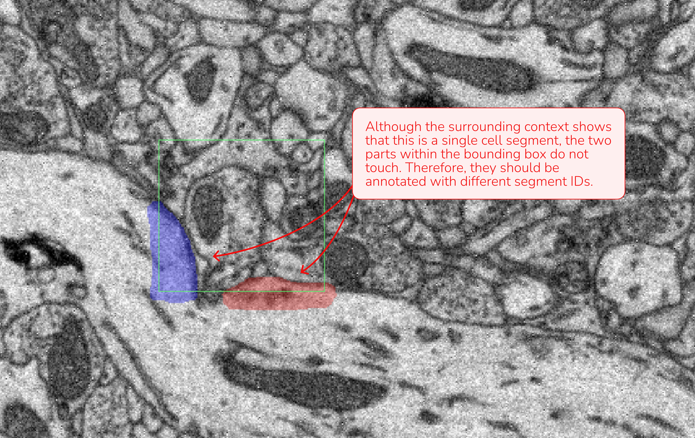
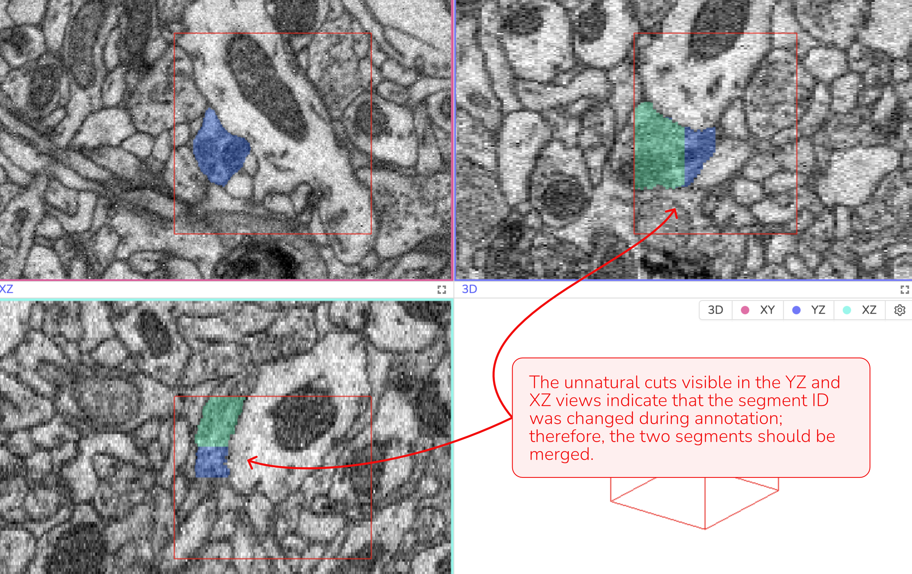
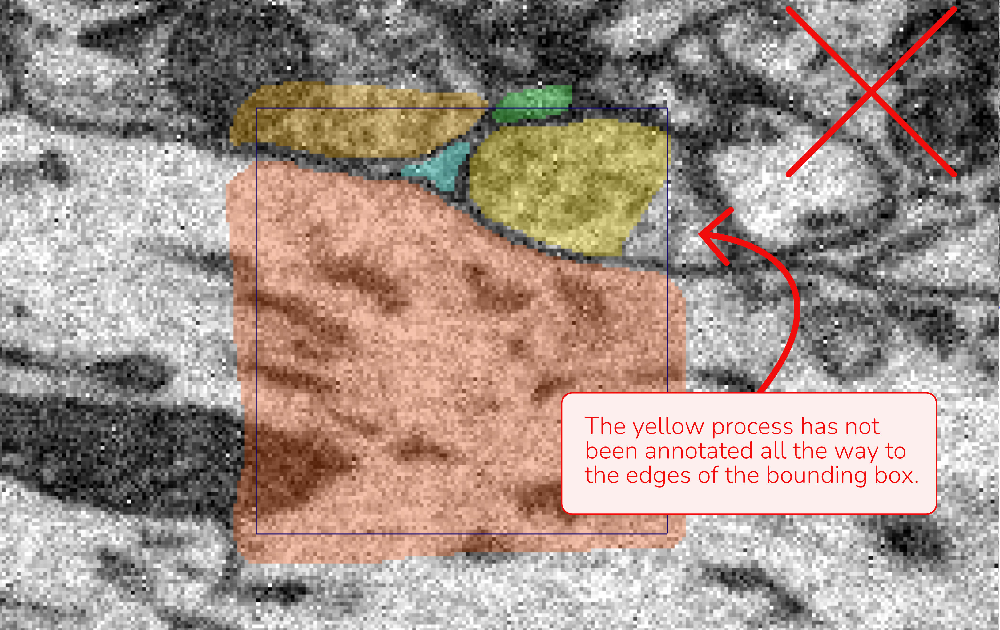
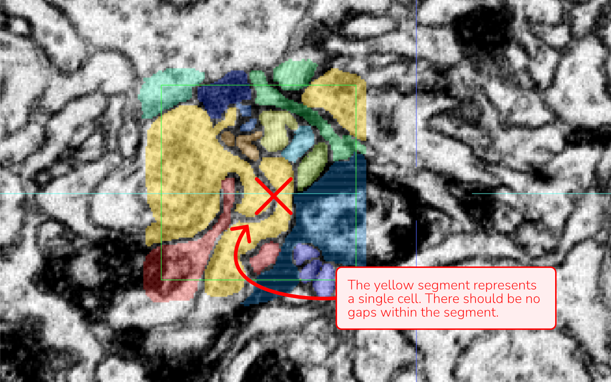
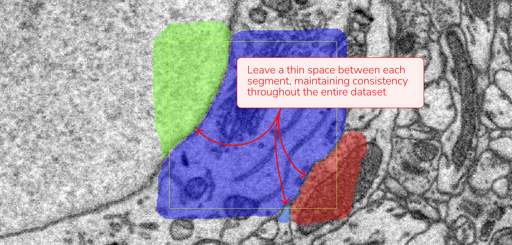
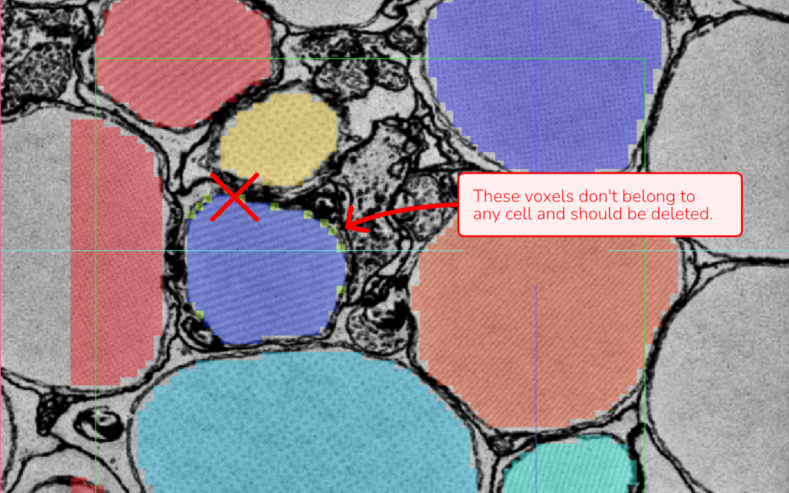

# Tutorial: Annotating Ground Truth Data for ML in WEBKNOSSOS

When preparing ground truth data for machine learning, accurate and consistent annotations are essential. The following guidelines will help you create high-quality training data in WEBKNOSSOS.

For detailed instructions on using WEBKNOSSOS for annotation, please watch our [Beginner’s Guide](https://docs.webknossos.org/webknossos/getting_started.html) and/or our tutorial on [Volume Annotations](https://docs.webknossos.org/webknossos/tutorial_volume_annotation.html).

---

## 1. Annotation Area

- **Bounding Box:** Annotations should be performed within the predefined bounding box. Annotate all segments that appear within the bounding box, including those that are only partially visible. Segmentation may extend beyond the bounding box boundaries; content outside the box does not matter, as long as the segmentation inside the box is complete.
- **Segment Distinction:** Since the ML model processes only the data within the bounding box, any cell parts that are not connected or directly adjacent inside the box must be assigned separate segment IDs, even if they appear to be part of the same cellular process.
    
    
    
    *Data attributions: Motta et al., 2019, Dense connectomic reconstruction in layer 4 of the somatosensory cortex*
    

---

## 2. Annotating Cell Segments

- **Unique Segment IDs:** Each cell within the bounding box should be annotated with its own distinct segment ID.
- **Sequential Approach:**
    - Start at the corner at the top, left and front of the bounding box.
    - Annotate the cell in that area, following its structure across all sections.
    - Once completed, return to the top and assign a new segment ID for the next cell. We advise you to leave the **cell membranes unannotated**.

This systematic approach minimizes errors and ensures that no parts of a cell are missed.

---

## 3. Maintain Consistency Across Annotations

Consistency is key to creating reliable ground truth data. Here are a few examples where shift in consistency might happen:

- **Uniform Quality:** If your annotation quality improves during the process, revisit and update earlier annotations for uniformity.
- **Membrane Boundaries:** If you chose to leave a thin gap between cells (choosing not to annotate the membrane), ensure this method is applied consistently across all annotations.
- **Extracellular Space:** Decide whether or not to annotate extracellular space and apply this choice consistently throughout your dataset.

---

## 4. Final Quality Check

A careful review of your annotations can prevent mistakes that might impact model performance. Consider these tips for your final quality check:

- **3D Verification:** Review the annotation in all three viewports (XY, XZ, and YZ) simultaneously. If you observe any unnatural lines or separations - especially in the XZ or YZ views - it may indicate an error that needs correction.
    
    
    
    *Data attributions: Motta et al., 2019, Dense connectomic reconstruction in layer 4 of the somatosensory cortex*
    
- **Complete Coverage:** Make sure no part of a cell is left unannotated. Even a small fragment in a corner of the bounding box should be included.
    
    
    
    *Data attributions: Motta et al., 2019, Dense connectomic reconstruction in layer 4 of the somatosensory cortex*
    
- **Gaps and Holes:** Look for any gaps or holes within a segment. Every cell should be annotated as a continuous, complete structure. If you see a darker line that suggests a membrane inside the same cell, it should be annotated; otherwise, an gap will be created.
    
    
    
    *Image attribution: Briggman et al., 2024, GAUSS-EM, guided accumulation of ultrathin serial sections with a static magnetic field for volume electron microscopy*
    
- **Disconnected Regions:** Ensure that segments which are not connected or directly adjacent within the bounding box have distinct segment IDs — even if they appear to be part of the same process.
    
    
    
    *Data attributions: Motta et al., 2019, Dense connectomic reconstruction in layer 4 of the somatosensory cortex*
    
- **Membrane Annotation Consistency between Cells:** Membranes separating two cells should remain unannotated consistently throughout your work.
    
    
    
    *Data attributions: Motta et al., 2019, Dense connectomic reconstruction in layer 4 of the somatosensory cortex*
    
- **Natural Cell Geometry:** Unnatural or irregular segment shapes in 3D often indicate a misunderstanding of the data or a mistake such as switching segment IDs during annotation.
    
    
    
    *Data attribution: Briggman et al., 2024, GAUSS-EM, guided accumulation of ultrathin serial sections with a static magnetic field for volume electron microscopy*
    
- **Isolated Voxels:** Check for stray voxels or remnants that don’t belong to any cell. These artifacts can occur when using automated tools or through a complex annotation process.
    
    
    
    *Data attribution: Briggman et al., 2024, GAUSS-EM, guided accumulation of ultrathin serial sections with a static magnetic field for volume electron microscopy*
    
- **Segment Registration and check:** Use the “Register segments in bounding box” function to compile a list of all annotated segments. Then, enable “Selective Visibility” under the annotation layer name to inspect each segment individually. Look for any inconsistencies such as:
    - Holes or gaps within segments
    - Isolated voxels that do not belong
    - “Unnatural” segment geometries
    
    *This method is especially relevant when using automated segmentation as the base for ground truth annotation, since it may generate new segments within the bounding box that you do not directly control.*
    
    
    
    *Data attribution: Briggman et al., 2024, GAUSS-EM, guided accumulation of ultrathin serial sections with a static magnetic field for volume electron microscopy*
    

---

By following these guidelines, you help ensure that your annotations are both accurate and consistent, thereby improving the overall quality of the training data for your ML models.