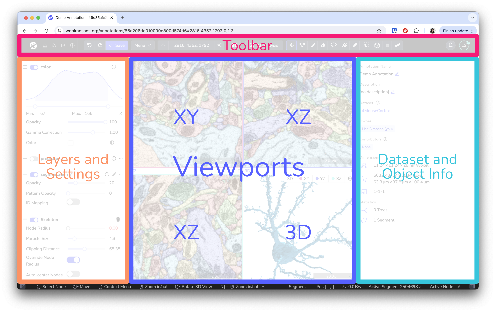
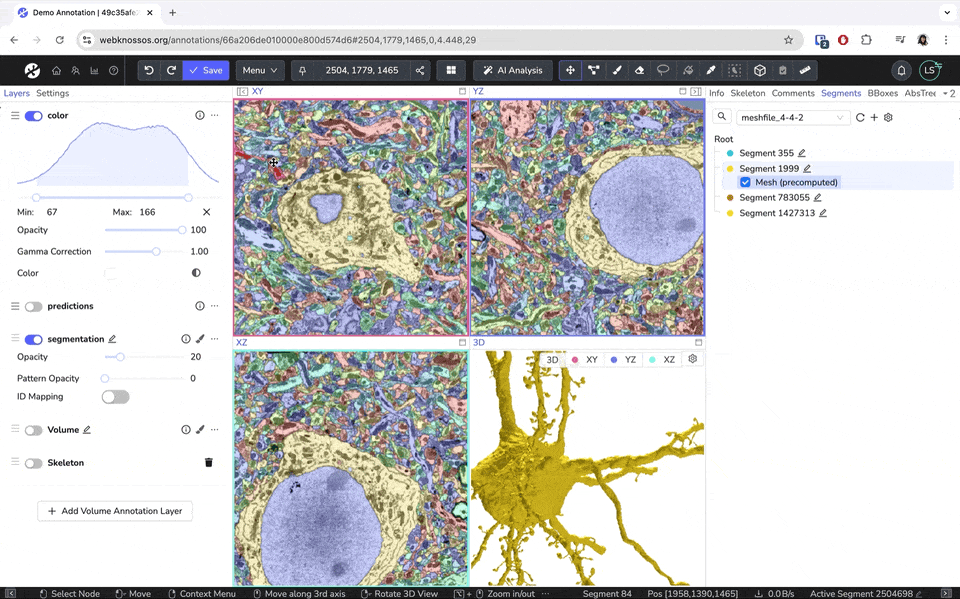

# Understanding the User Interface

The main WEBKNOSSOS user interface for viewing and annotating datasets is divided into five sections:

1. A [toolbar](./toolbar.md) for general-purpose features such as saving your work and displaying the current position within the dataset. Further, it provides access to all the tools for annotating and manipulating your data. It spans along the full width of the top of your screen.
2. The [left-hand side panel](./layers.md) provides a list of all available data, segmentation, and annotation layers as well as a settings menu for viewport options and keyboard controls.
3. The center of the screen is occupied by the annotation interface. Your dataset is displayed here, and you navigate and annotate it as desired. Most interactions will take place here.
4. The [right-hand side panel](./object_info.md) is occupied by several tabs providing more information on your current dataset, skeleton/volume annotations, and other lists. Depending on your editing mode these tabs might adapt.
5. The bottom of the screen is covered by a status bar showing context-sensitive hints for mouse controls as well as additional information on mouse hover.

You can customize the interface to your liking. Toggle the left and right sidebars, and drag the viewport edges to adjust the view. To reset the layout, go to Menu > Layout > Reset Layout in the toolbar.

Read More About [Skeleton Annotation](../skeleton_annotation/index.md)

Read More About [Volume Annotation](../volume_annotation/index.md)

