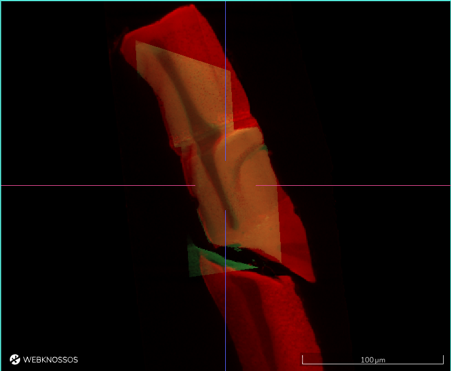
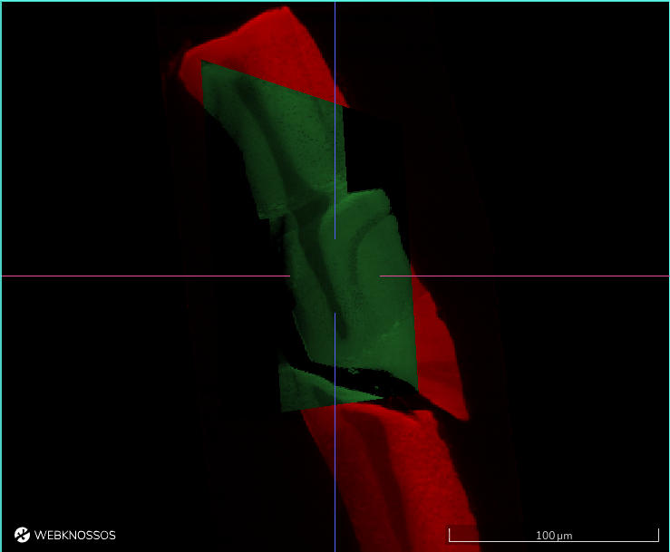

# Layers and Settings

The left-hand side panel features both a list of all available data and annotation layers as well as settings menu to fine-tune some parameters of WEBKNOSSOS.
All settings are automatically saved. When viewing a dataset without an annotation, settings are saved as part of your user profile. When viewing an annotation, layer visibility and other display settings are saved per user per annotation, so each collaborator maintains their own independent view.

## Layers Tab

Each dataset consists of one or more data and annotation layers. A dataset typically has at least one `color` layer containing the raw microscopy/etc image. Additional layers can include segmentations, skeleton and volume annotations. Each layer has several settings to adjust the viewing experience:

### Histogram & General Layer Properties

- `Histogram`: The Histogram displays sampled color values of the dataset on a logarithmic scale. The slider below the Histogram can be used to adjust the dynamic range of the displayed values. In order to increase the contrast of data, reduce the dynamic range. To decrease the contrast, widen the range. In order to increase the brightness, move the range to the left. To decrease the brightness, move the range to the right.
  Above the histogram, there is a three-dots context menu with more options to further adjust the histogram or otherwise interact with the layer:

      - `Edit histogram range`: Manipulate the min/max value of the histogram range. Clips values above/below these limits.
      - `Clip histogram`: Automatically adjust the histogram for best contrast and brightness. Contrast estimation is based on the data currently available in your viewport. This is especially useful for light microscopy datasets saved as `float` values.
      - `Reload from server`: Reload the layer data from server. Useful if the raw data has been changed on disk and you want to refresh your current session.
      - `Jump to data`: Navigates the WEBKNOSSOS camera to the center position within the dataset where there is data available for the respective layer. This is especially useful for working with smaller layers - likely segmentations - that might not cover the whole dataset and are hard to find manually.
      - `Edit layer transforms`: Opens the live transform editor for the layer. See [Live Layer Transform Editor](#live-layer-transform-editor) below.

- `Opacity`: Increase / Decrease the opacity of a layer. 0% opacity makes a layer invisible. 100% opacity makes it totally opaque. Useful for overlaying several layers above one another.
- `Gamma Correction`: Increase / Decrease the luminance, brightness and contrast of a layer through a non-linear gamma correction. Low values darken the image, high values increase the perceived brightness. (Color layers only.)
- `Visibility`: Use the toggle on the left side of layer name to enable/disable it. Toggling the visibility of a layer is often the quickest way to make information available in the dataset or hide to get an overview. Alternatively, use the shortcut '3' to toggle the visibility. 
  Disabling the visibility, unloads/frees these resources from your GPU hardware and can make viewing larger datasets more performant. Also, depending on your GPU hardware, there is a physical upper limit for how many layers - typically 16 or more - can be displayed at any time (WebGL limitation). Toggle layers as needed to mitigate this.

This video explains how to use the histogram settings to efficiently view your data: 

### Color and Segmentation Layers

In addition to the general layer properties mentioned above, `color` and `segmentation` layers come with a number of other settings:

- `Color`: Every `color` layer can be re-colored to make it easily identifiable. By default, all layers have a white overlay, showing the true, raw black & white data. Clicking on the square color indicator brings up your system's color palette to choose from. Note, there is an icon button for inverting all color values in this layer.
- `Pattern Opacity`: Adjust the visibility of the texture/pattern on each segment. To make segments easier to distinguish and more unique, a pattern is applied to each in addition to its base color. 0% hides the pattern. 100% makes the pattern very prominent. Great for increasing the visual contrast between segments.
- `Selective Visibility`: When activated, only segments are shown that are currently active or hovered.
- `ID Mapping`: WEBKNOSSOS supports applying pre-computed agglomerations/groupings of segmentation IDs for a given segmentation layer. This is a very powerful feature to explore and compare different segmentation strategies for a given segmentation layer. Mappings need to be pre-computed and stored together with a dataset for WEBKNOSSOS to download and apply. [Read more about this here](../proofreading/segmentation_mappings.md).

### Skeleton Annotation Layer

The skeleton annotation layer contains any trees that you add to your dataset. You can quickly toggle the visibility of all skeleton annotations by enabling/disabling this layer.

- `Node Radius`: Controls the size property of each node. Large values will render big nodes, small values create tiny nodes. Each node can have a different size. This is useful for annotations where node sizes encode a meaning.
- `Particle Size`: Controls the minimum node size for all nodes. This will globally override nodes falling below this node radius threshold. Used together with the `Override Node Radius` below.
- `Clipping Distance`: The distance between 3D structures and the camera used for hiding ("clipping") structures. Use it to reduce the number of visible nodes in the viewports and declutter your screen. The value don't have any effect if `Only Show Nodes of Current Section` is enabled (see next setting).
- `Only Show Nodes of Current Section`: When enabled, only skeleton nodes and edges that lie exactly on the currently visible section are rendered, regardless of the clipping distance setting. Edges that cross a section boundary are rendered only for the portion that falls within the current section. This is especially useful for dense skeletons where you want to see only what is directly visible in the current slice. This option is only available when neither the camera nor the dataset is rotated or transformed; otherwise it is automatically disabled and the clipping distance setting is used instead.
- `Override Node Radius`: When toggled, globally overrides all individual node sizes. This allows to uniformly adjust the size of all nodes simultaneously. Used together with the `Particle Size` setting.
- `Auto-center Nodes`: Per default, each time you place a node in a skeleton annotation, the WEBKNOSSOS viewport will center on this node. Disable, if you do not want the viewport to move/reposition while clicking nodes.
- `Highlight Commented Nodes`: When active, nodes that have a comment associated with them will be rendered with a slight border around them. This is useful for quickly identifying (important) nodes.

### Live Layer Transform Editor

The live transform editor lets you interactively adjust the spatial alignment of any color or segmentation layer without leaving the viewer. Open it via `··· menu -> Edit layer transforms` in the layer header.

The editor exposes three groups of controls, each with a slider, a numeric input, and a per-axis reset button:

- **Translation** – shifts the layer along X, Y, or Z. The slider range is bounded by the dataset extent for each axis.
- **Rotation** – rotates the layer around each axis independently (0 – 359.9°). Each rotation row also has a **flip** button that mirrors the layer along that axis. An axis that is currently flipped is highlighted by the flip button being shown in the primary color.
- **Scaling** – uniform or non-uniform scale per axis. The displayed value is always positive; flip state (sign) is controlled via the rotation-row flip buttons.

Every per-axis reset button restores that single value to the **stored default** — the transform that is saved on the server for this layer.

Two actions at the bottom of the popover apply to all three transform groups at once:

- **Reset to Stored Default** – reverts all three components (translation, rotation, scale) to the server-side values.
- **Store as Default** – persists the current live transform as the new server-side default, making it visible to all users of the dataset.

Changes made in the editor are applied immediately in the viewer but are not automatically saved. Use **Store as Default** to make them permanent.

The editor is only available for layers whose transform is in the compatible 7-matrix SRT format (translation, scale, rotX, rotY, rotZ, translation, translation). Layers with other transform formats (e.g. thin-plate spline or arbitrary affine JSON) will show an informational message instead, with instructions to clear the transforms in the [dataset settings](../datasets/settings.md#transformations) to unlock editing. The editor is also disabled while a layer is in native (untransformed) rendering mode — disable native rendering first by clicking the transform icon button to the left of the layer's `···` menu.

## Settings Tab

Note, not all control/viewport settings are available in every annotation mode.

### Controls

- `Keyboard delay (ms)`: The initial delay before an operation will be executed when pressing a keyboard shortcut. A low value will immediately execute a keyboard's associated operation, whereas a high value will delay the execution of an operation. This is useful for preventing an operation being called multiple times when rapidly pressing a key in short succession, e.g., for movement.

- `Move Value`: A high value will speed up movement through the dataset, e.g., when holding down ++space++. Vice-versa, a low value will slow down the movement allowing for more precision. This setting is especially useful in `Flight mode`.

- `d/f-Switching`: If d/f switching is disabled, moving through the dataset with `f` will always go *f*orward by _increasing_ the coordinate orthogonal to the current slice. Correspondingly, `d` will move backwards by decreasing that coordinate. However, if d/f is enabled, the meaning of "forward" and "backward" will change depending on how you create nodes. For example, when a node is placed at z == 100 and afterwards another node is created at z == 90, z will be _decreased_ when going forward.

- `Classic Controls`: Disabled by default to provide the best WEBKNOSSOS user experience. When enabled, several keyboard shortcuts and mouse interactions change to maintain backward compatibility for long-time users. See also the section on [Classic Keyboard Controls](../ui/keyboard_shortcuts.md#classic-controls).

### Viewport Options / Flight Options

- `Zoom`: The zoom factor for viewing the dataset. A low value moves the camera really close to the data, showing many details. A high value, will you show more of the dataset but with fewer details and is great for getting an overview or moving around quickly.
- `Show Crosshairs`: Shows / Hides the crosshair overlay over the viewports.
- `Show Scalebars`: Shows / Hides the scale bars overlay over the viewports.
- `Mouse Rotation`: Increases / Decreases the movement speed when using the mouse to rotate within the datasets. A low value rotates the camera slower for more precise movements. A high value rotates the camera quicker for greater agility.
- `Keyboard Rotation`: Increases / Decreases the movement speed when using the arrow keys on the keyboard to rotate within the datasets. A low value rotates the camera slower for more precise movements. A high value rotates the camera quicker for greater agility.
- `Crosshair Size`: Controls the size of the crosshair in flight mode.
- `Sphere Radius`: In flight mode, the data is projected on the inside of a sphere with the camera located at the center of the sphere. This option influences the radius of said sphere flattening / rounding the projected viewport. A high value will cause less curvature, showing the data with more detail and less distortion. A low value will show more data along the edges of the viewport.
- `Logo in Screenshots`: Enable or disable the WEBKNOSSOS watermark when [taking screenshots](./toolbar.md).

### Data Rendering

- `Hardware Utilization`: Adjusts the quality level used for rendering data. Changing this setting influences how much data is downloaded from the server as well as how much pressure is put on the user's graphics card. Tune this value to your network connection and hardware power. After changing the setting, the page has to be refreshed.
- `Loading Strategy`: You can choose between two different loading strategies. When using "best quality first" it will take a bit longer until you see data, because the highest quality is loaded. Alternatively, "Progressive quality" can be chosen which will improve the quality progressively while loading. As a result, initial data will be visible faster, but it will take more time until the best quality is shown.
- `Blend Mode`: You can switch between three modes for blending color layers. The default `Additive` mode simply sums up all color values of all visible color layers. The `Cover` mode renders all color layers on top of each other. Thus the top most color layer covers the color layers below. The `Cover (black as transparent)` mode behaves like `Cover`, but treats black voxels as transparent. The two `Cover` blend modes are especially useful for datasets using multi modality layers. Here is an example for such a dataset published by Bosch et al. [^1]:

|Additive Blend Mode        | &nbsp;&nbsp;&nbsp;&nbsp;Cover Blend Mode &nbsp; &nbsp;|
|:-------------------------:|:-------------------------:|
|||

- `4 Bit`: Toggles data download from the server using only 4 bit instead of 8 bit for each voxel. Use this to reduce the amount of necessary internet bandwidth for WEBKNOSSOS. Useful for showcasing data on the go over cellular networks, e.g 4G.
- `Interpolation`: When interpolation is enabled, bilinear filtering is applied while rendering pixels between two voxels. As a result, data may look "smoother" (or blurry when being zoomed in very far). Without interpolation, data may look more "crisp" (or pixelated when being zoomed in very far).
- `Render Missing Data Black`: If a dataset does not contain data at a specific position, WEBKNOSSOS can either render these voxels in "black" or it can try to render data from another magnification.

This video explains how to work with blend modes and order layer (especially relevant when working with fluorescence microscopy data):

[^1]: Bosch, C., Ackels, T., Pacureanu, A. et al. Functional and multiscale 3D structural investigation of brain tissue through correlative in vivo physiology, synchrotron microtomography and volume electron microscopy. Nat Commun 13, 2923 (2022). https://doi.org/10.1038/s41467-022-30199-6
