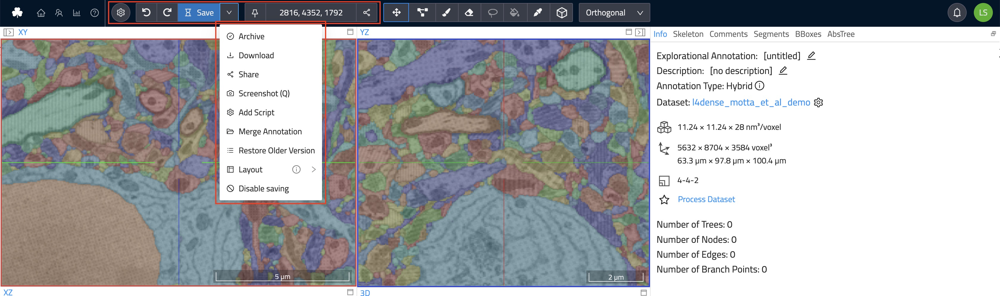
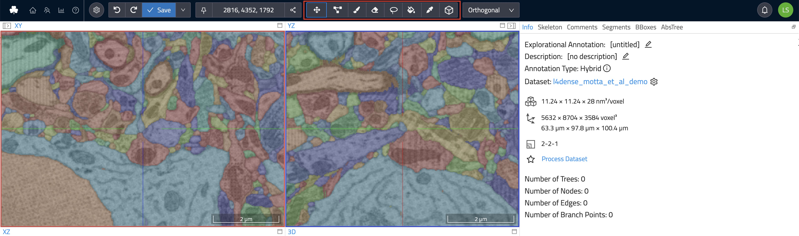

# The Toolbar

The toolbar contains frequently used commands, such as saving and sharing, your current position within the dataset, and the ability to switch between various modes for viewing. Further, it provides access to all the tools for annotation, navigation, and more.

The most common buttons are:

- `Undo` / `Redo`: Undoes the last operation or redoes it if no new changes have been made in the meantime. Undo can only revert changes made in this session (since the moment the annotation view was opened). To revert to older versions use the "Restore Older Version" functionality described later in this list.
- `Save`: Saves your annotation work. WEBKNOSSOS automatically saves every 30 seconds.
- `Menu`: 
  - `Archive`: Closes the annotation and archives it, removing it from a user's dashboard. Archived annotations can be found on a user's dashboard under "Annotations" and by clicking on "Show Archived Annotations". Use this to declutter your dashboard. (Not available for tasks)
  - `Download`: Starts a download of the current annotation including any skeleton and volume data. Skeleton annotations are downloaded as [NML](./data_formats.md#nml) files. Volume annotation downloads contain the raw segmentation data as [WKW](./data_formats.md#wkw) files.
  - `Share`: Create a customizable, shareable link to your dataset containing the current position, rotation, zoom level etc. with fine-grained access controls. Use this to collaboratively work with colleagues. Read more about [data sharing](./sharing.md).
  - `Duplicate`: Create a duplicate of this annotation. The duplicate will be created in your account, even if the original annotation belongs to somebody else.
  - `Screenshot`: Takes a screenshot of current datasets/annotation from each of the three viewports and downloads them as PNG files.
  - `Create Animation`: Creates an eye-catching animation of the dataset as a video clip. [Read more about animations](./animations.md).
  - `Merge Annotations`: Combines the skeletons and segments from one or more individual annotations into a new annotation.
  - `Add Script`: Using the [WEBKNOSSOS frontend API](https://webknossos.org/assets/docs/frontend-api/index.html) users can script and automate WEBKNOSSOS interactions. Enter and execute your user scripts (Javascript) from here. Admins can curate a collection of frequently used scripts for your organization and make them available for quick selection to all users.
  - `Restore Older Version`: Opens a window that shows all previous versions of an annotation. WEBKNOSSOS keeps a complete version history of all your changes to an annotation (separate for skeleton/volume). From this window, any older version can be selected, previewed, and restored.
  - `Layout`: The WK annotation user interface can be resized, reordered, and customized to suite your workflows. Use the mouse to drag, move and resize any viewport. You can safe these layout arrangements or restore the default viewport state.
- `Quick Share`: Create a shareable link to your dataset containing the current position, rotation, zoom level etc. Use this to collaboratively work with colleagues. Read more about [data sharing](./sharing.md).
- `AI Analysis`: Starts an AI segmentation of the datasets. Choose between several automated analysis workflows. Read more about [AI analysis](./automated_analysis.md).

A user can directly jump to any position within their datasets by entering them in the position input field.
The same is true for the camera rotation in flight/oblique modes.
Clicking on the position or rotation labels copies the values to the clipboard.

The toolbar further features all available navigation and annotation tools for quick access:

- `Move`: Navigate around the dataset.
- `Skeleton`: Create skeleton annotations and place nodes. [Read more about skeleton annotations](./skeleton_annotation.md#tools).
- `Trace`: Creates volume annotations by drawing outlines around the voxels you would like to label. [Read more about volume annotations](./volume_annotation.md#tools).
- `Brush`: Creates volume annotations by drawing over the voxels you would like to label.
- `Erase (Trace/Brush)`: Removes voxels from a volume annotation by drawing over the voxels you would like to erase.
- `Fill Tool`: Flood-fills the clicked region with a volume annotation until it hits the next segment boundary (or the outer edge of your viewport). Used to fill holes in a volume annotation or to relabel a segment with a different id.
- `Segment Picker`: Select the volume annotation ID of a segment to make it the active cell id to continue labeling with that ID/color.
- `Bounding Box`: Creates and resizes any bounding box. See also the [Bounding Box (BB) panel](./tracing_ui.md#right-hand-side-panel) below.
- `Measurement Tool`: Measure distances between structures or the surface areas of segments by placing waypoints with the mouse.

Please see the detailed documentation on [skeleton](./skeleton_annotation.md#tools) and [volume annotation](./volume_annotation.md#tools) tools for a for explanation of all context-sensitve modifiers that are available to some tools.

