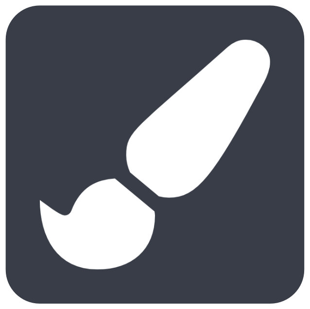

# The Toolbar

The toolbar is your primary interface for interacting with WEBKNOSSOS. Located at the top of the screen, it provides quick access to essential functions for viewing, annotating, and sharing your work. This guide explains each component and its purpose in your workflow.

## Basic Operations

### Save and Undo
The save and undo functions help you manage your annotation work:

- The **Save** button preserves your current work. While WEBKNOSSOS automatically saves every 30 seconds, you can manually save at any time using the keyboard shortcut `Ctrl/Cmd + S`.

- The **Undo/Redo** buttons let you reverse or restore recent changes. The undo function (`Ctrl/Cmd + Z`) can revert any changes made in your current session, while redo (`Ctrl/Cmd + Y`) restores previously undone changes. For accessing older versions of your work, use the "Restore Older Version" feature in the menu.

### Position Control
The position control allows precise navigation within your dataset. You can:

- Enter specific coordinates to jump directly to any location
- Copy position values by clicking on the coordinate display
- Adjust camera rotation in flight or oblique modes
- The position information is automatically included when sharing your view with colleagues

## Menu Functions

### File Operations
The menu provides several ways to manage your annotations:

- **Download**: Export your work in standard formats:

    - Skeleton annotations are saved as [NML files](../data/concepts.md#nml-files)
    - Volume annotations are exported as [WKW files](../data/wkw.md)
    - All associated data and metadata are included in the download

- **Archive**: When you need to declutter your dashboard, you can archive annotations you're not actively working on. Archived items remain accessible through the "Show Archived Annotations" filter on your dashboard. Note that this option isn't available for tasks.

- **Restore Older Version**: WEBKNOSSOS maintains a complete history of your annotations with version control. You can access previous versions of your work and preview changes before restoring them.

- **Merge Annotations**: Combine multiple annotations into one either by project or by annotation ID.

- **Disable Saving**: Temporarily disable automatic saving in WEBKNOSSOS. Any changes you make will not be saved. This can save a lot of bandwith and resources when dealing with very large annotation which don't need to be persisted.

- **Lock Annotation**: Lock your current annotation in a read-only mode to protect it from any accidental changes. The annotation remains read-only until you unlock it (from the [Annotation dashboard](../dashboard/annotations.md)). This can be useful when publishing your work or sharing with larger communities.

### Collaboration Tools
WEBKNOSSOS offers multiple ways to share your work:

- **Share**: Create customized sharing links that capture your current view, including position, rotation, and zoom level. You can set specific access permissions to control who can view or edit your work. Learn more about [sharing options](../sharing/annotation_sharing.md).

- **Quick Share**: Generate an immediate sharing link that includes your current view settings. This is ideal for rapid collaboration or when you need to quickly show something to a colleague.

- **Screenshots**: Capture and download a snapshot of your current viewports as a JPEG image. 

### Advanced Features

- **Zarr Links**: Generate streaming links that allow other applications to access your annotation's image data. This is particularly useful when integrating WEBKNOSSOS with external analysis tools.

- **Create Animation**: Produce professional video clips that showcase your dataset. These animations can be valuable for presentations or documentation. Read more about [creating animations](../automation/animations.md).

- **Layout**: Modify the layout of the WEBKNOSSOS user interface and resize, reorder and adjust viewports and panels to your preferences. Customize the number of columns, show or hide specific tabs, and adjust the size of the sidebar. Save and restore your preferred configurations. 

## Annotation Tools

### Navigation
{align=left width="60"} 
The **Move tool** serves as your primary means of navigating through the dataset:

- Pan across slices using click and drag
- Zoom in and out to focus on details or get an overview
- Rotate the view in 3D mode

### Skeleton Annotation
{align=left width="60"} 
The **Skeleton tool** enables you to create and edit skeleton annotations:

- Place nodes with precise positioning
- Connect nodes to form tree structures
- Add branches and create complex neural tracings

For detailed information, see the [skeleton annotation guide](../skeleton_annotation/tools.md).

### Volume Annotation
WEBKNOSSOS provides several tools for volume annotation:

{align=left width="60"} 
**Trace Tool**: Create precise boundary definitions by drawing outlines around structures. This tool is particularly useful when accuracy is crucial. For added precision consider using a [pen input device](../pen_tablets.md). 

{align=left width="60"} 
**Brush Tool**: Paint directly onto the dataset to mark regions of interest. The brush size is adjustable and . If you draw around objects in one continuous motion, the inside will be filled automatically.

{align=left width="60"} 
**AI Quick Select**: Annotate a segment automatically with our AI by drawing a rectangular selection over it. Alternatively, single click in the center of a cell to automatically label it.

And many other tools. For detailed information, see the [volume annotation guide](../volume_annotation/tools.md).

### Measurement and Analysis
{align=left width="60"}
**Measurement Tool**: Allows you to calculate distances between points of interest, measure surface areas of segmented structures, and place waypoints for complex measurements.

{align=left width="60"}
**AI Analysis**: Launch automated segmentation processes using various analysis workflows. The AI tools can significantly speed up your annotation work. Learn more about [AI-assisted analysis](../automation/ai_segmentation.md).

{align=left width="60"}
**Bounding Box Tool**: Create a bounding box to define a region of interest for analysis, subdivide a dataset into smaller regions for the builtin automated workflows, or quickly export a region of interest.

For detailed information, see the [Advanced Analysis Tools](../automation/ai_segmentation.md).
