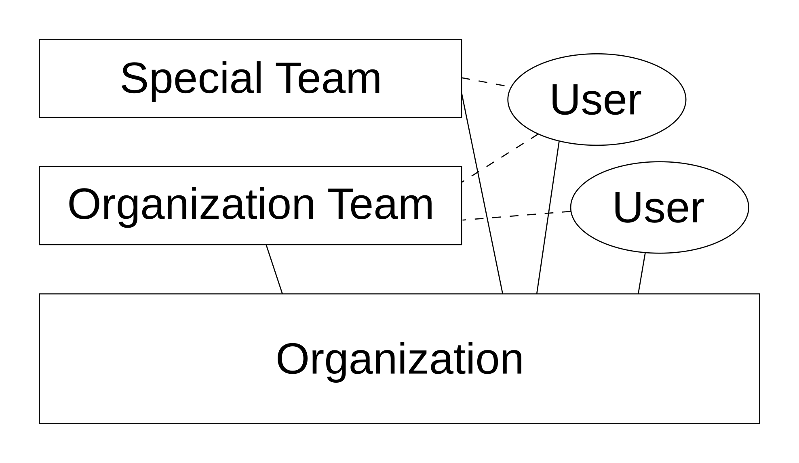
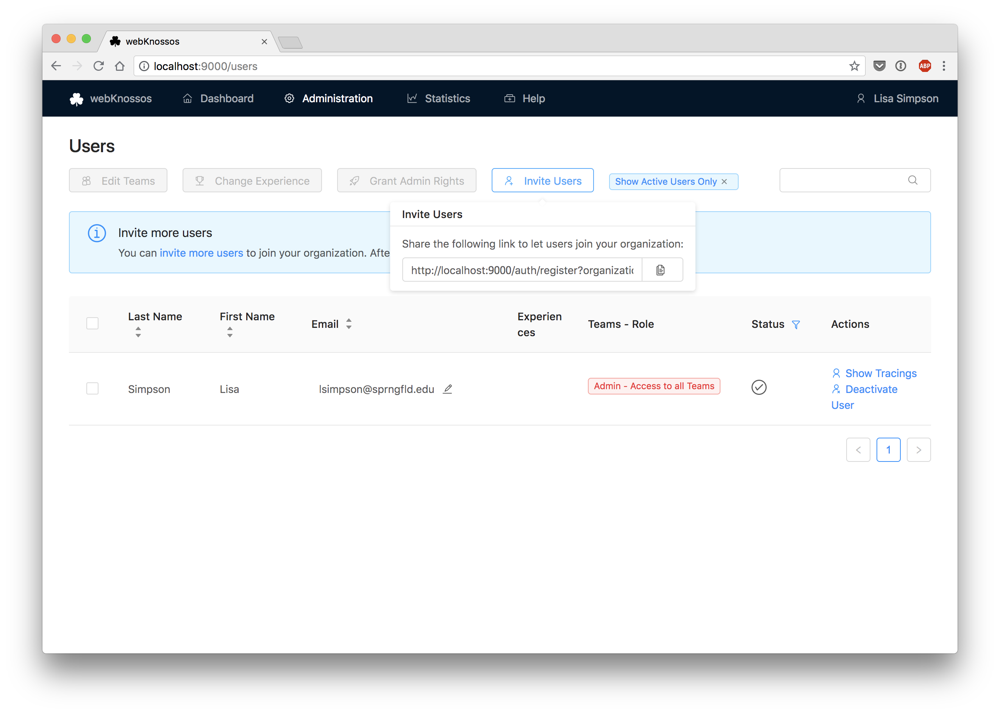
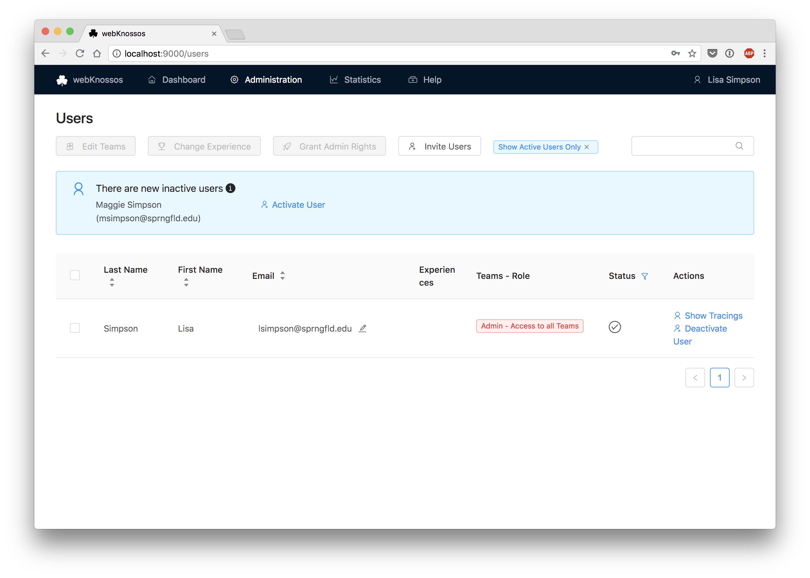

# Managing Users & Access Permissions

webKnossos offers a built-in user management system to administer different user roles and permissions.

## Organizations

The root entity in webKnossos is an **organization**.
You will create one when setting up webKnossos.
This organization will contain all your users, datasets, annotations, and other data.
Organizations are isolated.
You are not allowed to see data from organizations other than your own and members from other organizations will not be able to see data from your organization.

When creating your organization, a default team with the same name will be created.
This team is referred to as the **organization team**.
Users that register for your organization will, by default, be assigned to that organization team.
An organization can contain as many teams as you like.
Users can be assigned to multiple teams.
Teams are useful for managing dataset access permissions or simply to organize users into logical groups.

## Access Rights / Roles

The webKnossos permissions system is designed to 1) control read/write access to datasets and 2) limit access to certain administration functionalities.

There are four different roles for webKnossos users divided into global, organization-wide roles and team-based permissions:

**On a per team basis:**

  - __Member:__ A regular wK user account. Members are only able to access datasets of their respective teams and can create annotations for those. Further, they can work on tasks created by their `Team Manager` or an `Admin`. They are only able to access their own annotations or [annotations shared with them](./sharing.md).

  - __Team Manager:__ Manage a specific team. Team Managers can administrate and create [Tasks, Task Types, and Projects](./tasks.md) belonging to their respective teams. They also can activate newly registered users and assign/remove users to/from their teams. Team managers can access all annotations belonging to users of their respective teams. Similarly to regular `Members`, they are only able to access datasets of their respective teams and can create annotations for those.

**On an organizational level:**

  - __Admin:__ Manage a whole organization including full access to all datasets, teams, and projects. Admins can access all administrative settings - similiar to `Team Managers` but for all teams - and have full control over all datasets - similar to `Dataset Managers`. They can promote other users to `Admin` or to `Dataset Manager` by using the `Edit Teams and Permissions` modal at the top of the user list. Admins can access all annotations, datasets, projects, tasks, etc belonging to their respective organization.

  - __Dataset Manager:__ Manage all datasets of an organization. Dataset Managers have full read/write access to all datasets within their respective organizations regardless of whether a dataset has been made available only to a specific team. Use this role for power users who regularly upload datasets or who need access to all datasets regardless of who created them.
  Unlike `Admins`, Dataset Managers do NOT have access to any of the administration interfaces for users, tasks, and projects.

Only *Admins* and *Team Managers* can see/access the `Admin` menu options in the navigation bar.

By default, each newly uploaded dataset can only be accessed by `Admins` and `Dataset Managers`. Add or remove more teams to a dataset for fine-grained access controls. `Team Managers` can also upload datasets via the UI and assign teams during this step. For more information regarding dataset and access rights, [see the dataset guide](./sharing.md#general)

| Action                                           	| Admin 	| Dataset Manager 	| Team Manager 	| Team Member 	|
|--------------------------------------------------	|-------	|-----------------	|--------------	|-------------	|
| Access datasets of own teams                        	| Yes   	| Yes             	| Yes          	| Yes         	|
| Access datasets of other teams                      	| Yes   	| Yes             	| No           	| No          	|
| Edit datasets of own teams                       	| Yes   	| Yes             	| Yes          	| No          	|
| Edit datasets of other teams                     	| Yes   	| Yes             	| No           	| No          	|
| Access all users of own teams                       	| Yes   	| Yes             	| Yes          	| Yes         	|
| Access all users of other teams                     	| Yes   	| Yes             	| Yes          	| No          	|
| Assign/remove team membership to own teams       	| Yes   	| No              	| Yes          	| No          	|
| Make other users team manager of own teams   	| Yes   	| No              	| Yes          	| No          	|
| Make other users team manager of other teams   	| Yes   	| No              	| No           	| No          	|
| Grant *Dataset Manager* role to others        	| Yes   	| No              	| No           	| No          	|
| Grant *Admin* role to others                           	| Yes   	| No              	| No           	| No          	|
| Access time tracking for oneself                       	| Yes   	| Yes             	| Yes          	| Yes         	|
| Access time tracking for users of managed teams          	| Yes   	| No              	| Yes          	| No          	|
| Create scripts (visible to everyone)            	| Yes   	| No              	| Yes          	| No          	|
| Upload Datasets via UI                           	| Yes   	| Yes             	| Yes          	| No          	|
| Set team access permissions upon dataset upload    	| Yes   	| Yes              	| Yes          	| No          	|
| Get tasks again after cancelling an instance     	| Yes   	| No              	| Yes          	| No          	|
| Access to wK Statistics Menu  	| Yes   	| No              	| Yes          	| No          	|

## Registering New Users

New users can signup for webKnossos by clicking on the `Register Now` button in the navigation bar.
In the registration form, they need to specify some basic information, and confirm acceptance of the privacy agreement.

If there is just one organization in the webKnossos instance, they are assigned to that organization automatically but need to be activated by an administrator, compare below.


You can also invite users to your webKnossos organization, by clicking the `Invite Users` button at the top of the user list. This will open a popup where you can enter a list of email addresses, which will receive a custom invitation link. Users that click on this link are automatically assigned to your organization, and will not need manual activation.



## Activating New Users

If newly registered users did not join via custom invite link, they are deactivated at first and need to be activated by an admin or a team manager.
By default, the user list only shows active users, so make sure to deactivate the `Show Active Users Only` filter at the top of the user list to activate new users.
However, deactivated users that registered in the last 14 days, will be shown above the user list regardless and can be activated quickly from there.

When activating new users, a popup opens for
  - team assignment
  - access role assignment

## Password Reset / Change Email Address

Users can _change_ their password by themselves if they are logged in. Password reset can be found by clicking on their username in the navigation bar in the top-right corner of the screen and selecting `Change Password`. Users need to provide their current password and choose a new one.

Logged-out users can _reset_ their password by clicking on `Forgot Password` in the navigation bar in the top-right corner of the screen. They will have to provide their registered email address and will be sent an email containing a token and instructions to reset the password.

Admins can modify the email address of each user from the user administration list. Select the `Edit` icon next to a user's email address, enter the new email address, and confirm the change. Remember to inform the user about the successful change of the email address, since the new email address will be used for the login credentials.
