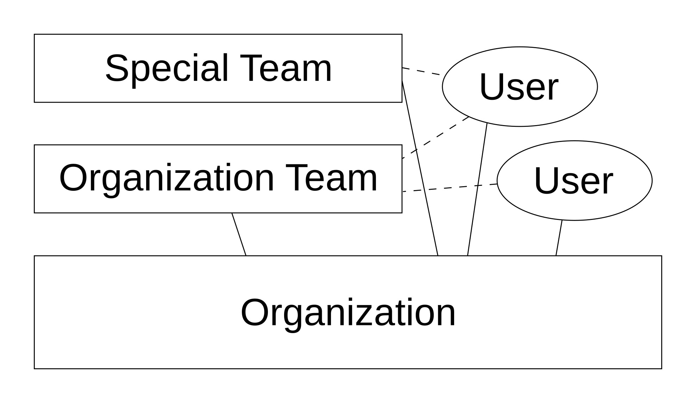
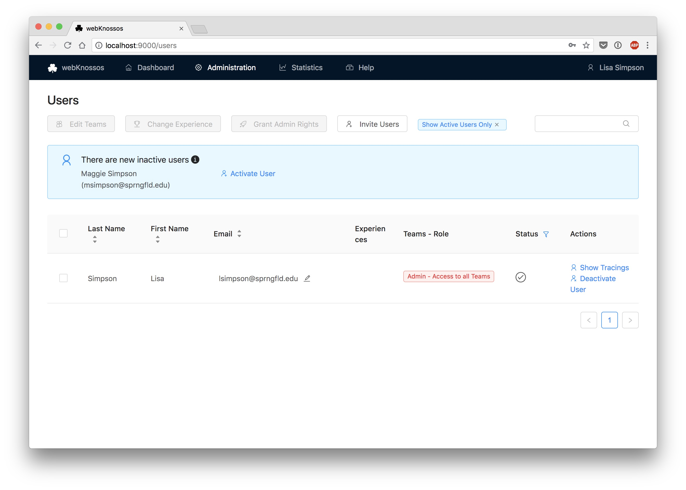
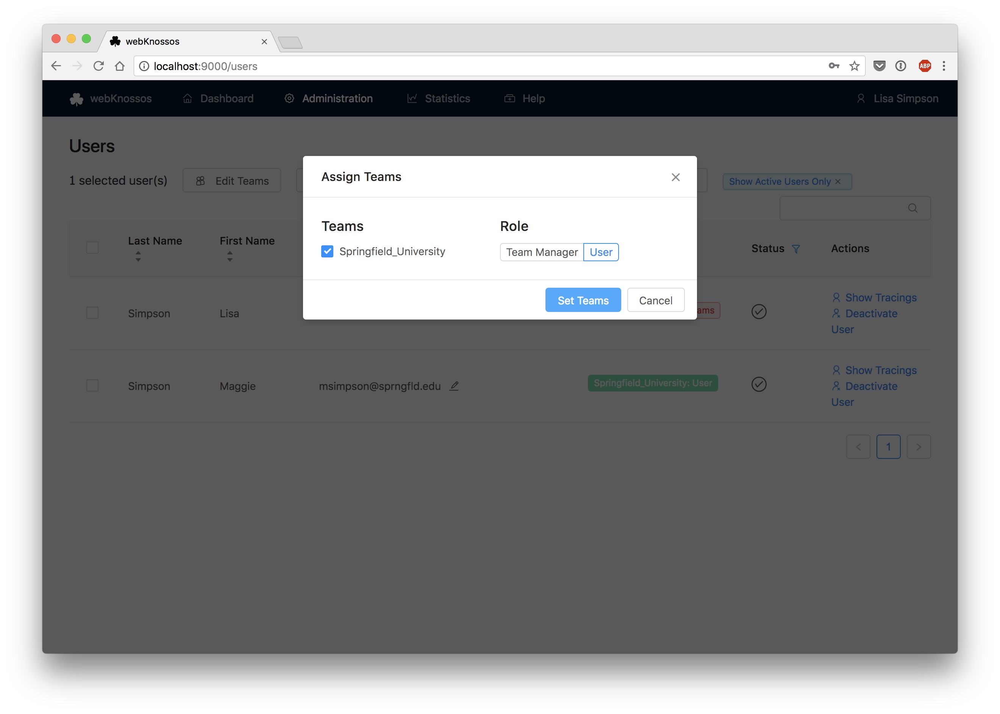

# Managing Users & Access Permissions

WEBKNOSSOS offers a built-in user management system to administer different user roles and permissions.

## Organizations

The root entity in WEBKNOSSOS is an *organization*.
You will create one when setting up WEBKNOSSOS or when signing up for an account on [webknossos.org](https://webknossos.org).
An organization contains all your users, datasets, annotations, and other data.
Organizations are isolated from each other.
You are not allowed to see data from organizations other than your own. 
Members from other organizations will not be able to see data from your organization.

You can invite other users to join your organization and collaborate on datasets. Datasets and annotations are shared between members of an organization. You can finetune access rights to datasets and visibility on the dashboard on various levels.

## Teams
Teams can be used to organize an organization's users into groups. Teams are useful for managing dataset access permissions, task/project management, or simply for organizing users into logical groups.

When creating your organization, a default team is created for you.
All new organization members are assigned to that team by default.

An organization can contain as many teams as you like. Users can be assigned to multiple teams.

## Access Rights / Roles

The WEBKNOSSOS permissions system is designed to 1) control read/write access to datasets and 2) limit access to certain administration functionalities.

There are four different roles for WEBKNOSSOS users divided into global, organization-wide roles and team-based permissions:

*On a per team basis:*

  - __Member:__ A regular wK user account. Members are only able to access datasets of their respective teams and can create annotations for those. Further, they can work on tasks created by their `Team Manager` or an `Admin`. They are only able to access their own annotations or [annotations shared with them](./sharing.md).

  - __Team Manager:__ Manage a specific team. Team Managers can administrate and create [Tasks, Task Types, and Projects](./tasks.md) belonging to their respective teams. They also can activate newly registered users and assign/remove users to/from their teams. Team managers can access all annotations belonging to users of their respective teams. Similarly to regular `Members`, they are only able to access datasets of their respective teams and can create annotations for those.

*On an organizational level:*

  - __Admin:__ Manage a whole organization, including full access to all datasets, teams, and projects. Admins can access all administrative settings - similar to `Team Managers` but for all teams - and have full control over all datasets - similar to `Dataset Managers`. They can promote other users to `Admin` or to `Dataset Manager` by using the `Edit Teams and Permissions` modal at the top of the user list. Admins can access ALL annotations, datasets, projects, tasks, etc belonging to their respective organization and can modify any setting of an organization. Admins have the most permissions in your organization, and this role should be assigned with care.

  - __Dataset Manager:__ Manage all datasets of an organization. Dataset Managers have full read/write access to all datasets within their respective organizations regardless of whether a dataset has been made available only to a specific team. They can also set team permissions for datasets. Use this role for power users who regularly upload datasets or who need access to all datasets regardless of who created them.
  Unlike `Admins`, Dataset Managers do NOT have access to any of the administration interfaces for users, tasks, and projects.

Only *Admins* and *Team Managers* can see/access the `Admin` menu options in the navigation bar.

By default, each newly uploaded datasets can only be accessed by `Admins` and `Dataset Managers` without any restrictions. Make sure to add or remove one or more teams to a dataset for fine-grained access controls while/after uploading. Otherwise, regular `Members` or `Team Managers` might not be able to see a dataset in their dashboard, let alone create annotations for them. `Team Managers` can also upload datasets via the UI and assign teams during this step. 

For more information regarding (public) dataset sharing and access rights (especially with outside collaborators), [see the dataset guide](./sharing.md#general)

| Action                                           	| Admin 	| Dataset Manager 	| Team Manager 	| Team Member 	|
|--------------------------------------------------	|-------	|-----------------	|--------------	|-------------	|
| Access datasets of own teams                        	| Yes   	| Yes             	| Yes          	| Yes         	|
| Access datasets of other teams                      	| Yes   	| Yes             	| No           	| No          	|
| Edit datasets of own teams                       	| Yes   	| Yes             	| Yes          	| No          	|
| Edit datasets of other teams                     	| Yes   	| Yes             	| No           	| No          	|
| Access all users of own teams                       	| Yes   	| Yes             	| Yes          	| Yes         	|
| Access all users of other teams                     	| Yes   	| Yes             	| Yes          	| No          	|
| Assign/remove team membership to own teams       	| Yes   	| No              	| Yes          	| No          	|
| Make other users team manager of own teams   	| Yes   	| No              	| Yes          	| No          	|
| Make other users team manager of other teams   	| Yes   	| No              	| No           	| No          	|
| Grant *Dataset Manager* role to others        	| Yes   	| No              	| No           	| No          	|
| Grant *Admin* role to others                           	| Yes   	| No              	| No           	| No          	|
| Access time tracking for oneself                       	| Yes   	| Yes             	| Yes          	| Yes         	|
| Access time tracking for users of managed teams          	| Yes   	| No              	| Yes          	| No          	|
| Create scripts (visible to everyone)            	| Yes   	| No              	| Yes          	| No          	|
| Upload Datasets via UI                           	| Yes   	| Yes             	| Yes          	| No          	|
| Set team access permissions for datasets    	| Yes   	| Yes              	| Yes          	| No          	|
| Get tasks again after canceling an instance     	| Yes   	| No              	| Yes          	| No          	|
| Access to wK Statistics Menu  	| Yes   	| No              	| Yes          	| No          	|

## Sign Up & Invitations for New User Accounts
On webknossos.org, users can either sign up for a WEBKNOSSOS account by themselves or be invited through email to join an existing organization by co-workers or collaborators. On private WEBKNOSSOS instances, users can only join through an email invitation.

!!!info
    As an admin or team manager, you can invite users to join your WEBKNOSSOS organization by clicking the `Invite Users` button at the top of the `Users` list available from the `Admin` menu in the navbar. This will open a popup where you can enter a list of email addresses, which will receive a custom invitation link. Users that click on this link are automatically assigned to your organization, and will not need manual activation.

    

## Switching Organizations
A WEBKNOSSOS user account can be part of more than one organization, .e.g., when your are invited to collaborate on projects of another institute, working as a different WEBKNOSSOS organization.

If you are part of multiple organizations, you can switch between them from the "User avatar" menu. 
Click on your user avatar in the top-right corner of the screen and select an entry from the "Switch Organization" menu.
WEBKNOSSOS will quickly reload and switch your account to that organization, i.e. refresh your dashboard, access permissions, annotations, etc. to match your account in the selected organization.

## Activating New Users
- not applicable to webknossos.org - 

If newly registered users did not join via an email invite link, they join a WEBKNOSSOS organization with the status "deactivated". An admin or a team manager needs to approve them and activate their user account before they can access anything on your WEBKNOSSOS instance. 
Users that registered within the last 14 days are shown above the `Users` list (accessible from the Admin menu) and can be activated quickly from there.
After that time or by default for any other inactive users, the `Users` list only shows active users, so make sure to deactivate the `Show Active Users Only` filter at the top of the user list to see/activate new users.

When activating new users, a popup opens for

  - team assignment
  - access role assignment

## Password Reset / Change Email Address

Users can _change_ their account password by themselves if they are logged in. Password reset can be found by clicking on their user avatar in the navigation bar in the top-right corner of the screen and selecting `Change Password`. Users need to provide their current password and choose a new one.

Logged-out users can _reset_ their password by clicking on `Forgot Password` in the navigation bar in the top-right corner of the screen. They have to provide their email address and will receive an email containing instructions to reset the password.

Admins can update the email address of each user from the `Users` administration page. 
Select the `Edit` icon next to a user's email address, enter the new email address, and confirm the change. 
Remember to inform the user about the successful change of an email address since the new email address will be used for the login credentials.

# Experience Levels
For a fine-grained assignment to [annotation tasks](./tasks.md), each user can have one or more experience levels assigned to them. Based on their respective experience level, tasks may or may not be distributed to them.

Assign/Remove experience levels by selecting one/several users and clicking on the `Change Experience` button. In the pop-up window, you can select any existing experience from the dropdown or type the domain name of a new experience domain in the dropdown input. 

Each experience domain is combined with a numeric value indicating the proficiency of the respective user.  
E.g., a season annotator may have the experiences `nuclei: 10` and  `mitochondria: 7`, while a rookie could start at `nuclei: 1` to codify that he has not worked on mitochondria annotation at all and just started with his first nuclei reconstruction project. 

Experience domains are referenced during task type and project creation and task distributing respectively. 
Domain names and values are arbitrary and can be customized to make sense for your organization. 
