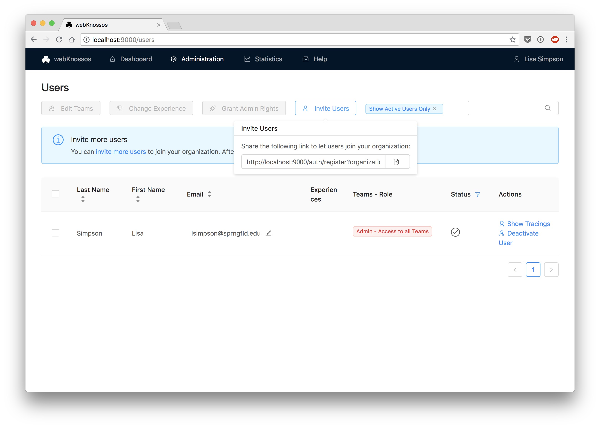

## Sign Up & Invitations for New User Accounts
On webknossos.org, users can either sign up for a WEBKNOSSOS account by themselves or be invited through email to join an existing organization by co-workers or collaborators. 

As an admin or team manager, you can invite users to join your WEBKNOSSOS organization by clicking the `Invite Users` button at the top of the `Users` list available from the `Admin` menu in the navbar. This will open a popup where you can enter a list of email addresses, which will receive a custom invitation link. Users that click on this link are automatically assigned to your organization, and will not need manual activation.

## Experience Levels
For a fine-grained assignment to [annotation tasks](../tasks_projects/tasks.md), each user can have one or more experience levels assigned to them. Based on their respective experience level, tasks may or may not be distributed to them.

Assign/Remove experience levels by selecting one/several users and clicking on the `Change Experience` button. In the pop-up window, you can select any existing experience from the dropdown or type the domain name of a new experience domain in the dropdown input. 

Each experience domain is combined with a numeric value indicating the proficiency of the respective user.  
E.g., a season annotator may have the experiences `nuclei: 10` and  `mitochondria: 7`, while a rookie could start at `nuclei: 1` to codify that he has not worked on mitochondria annotation at all and just started with his first nuclei reconstruction project. 

Experience domains are referenced during task type and project creation and task distributing respectively. 
Domain names and values are arbitrary and can be customized to make sense for your organization. 
