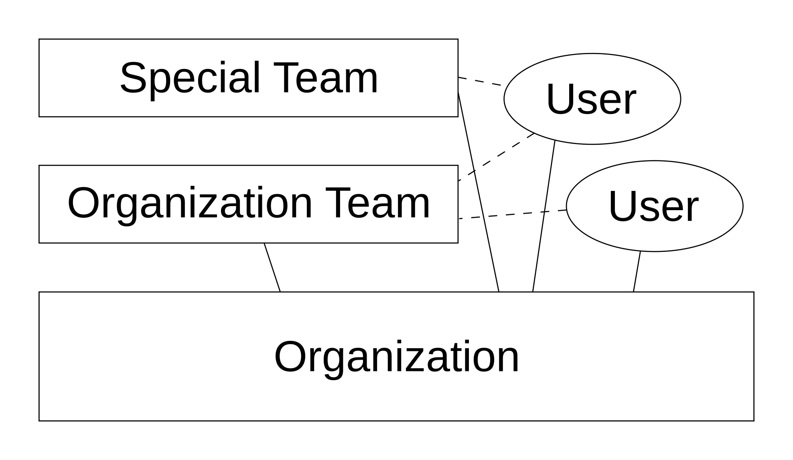
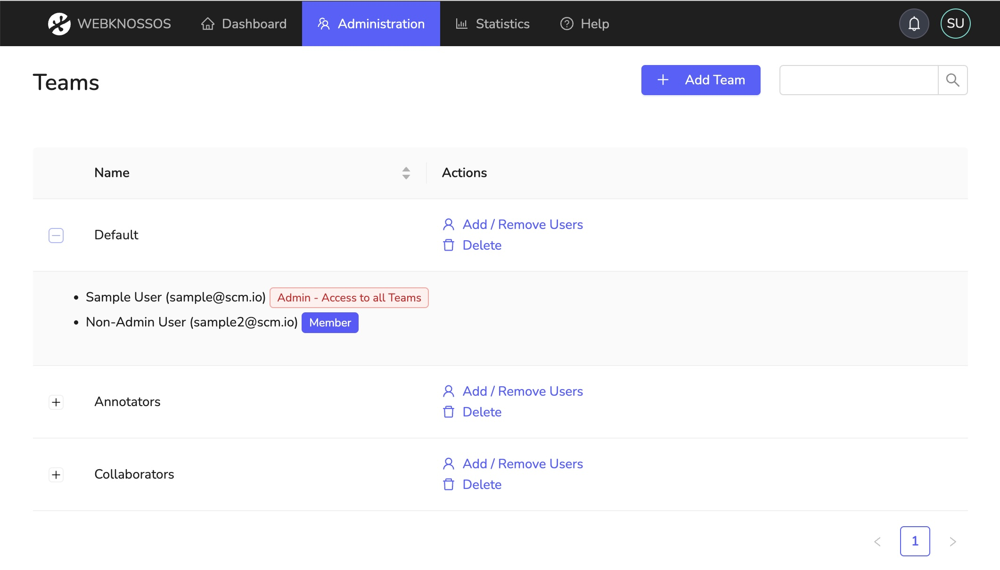

# Teams
Teams can be used to organize an organization's users into groups. Teams are useful for managing dataset access permissions, task/project management, or simply for organizing users into logical groups.

When creating your organization, a default team is created for you.
All new organization members are assigned to that team by default.

An organization can contain as many teams as you like. Users can be assigned to multiple teams.

## Creating New Teams
To create a new team for your organization:

1. Navigate to `Admin > Teams` in the navigation bar
2. Click the `Add Team` button in the upper right corner
3. In the dialog that appears:
   - Enter a unique team name
   - Select users to add to this team (optional)
4. Close the team assignment dialog

After creating a team, you can manage its members and permissions through the [Users page](./new_users.md#adding-users-to-teams).

