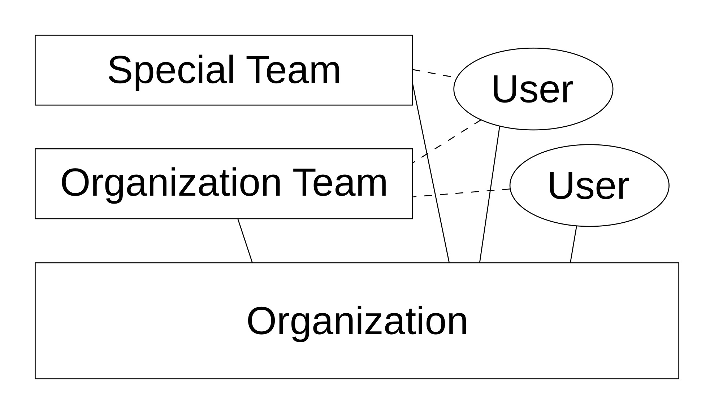
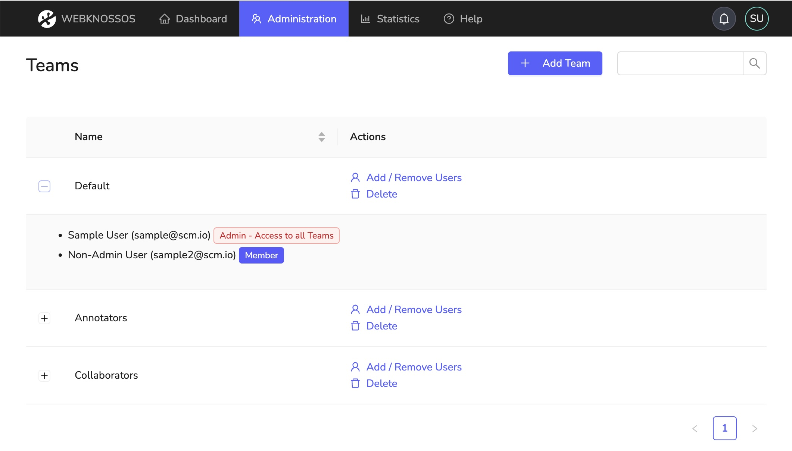

# Teams
Teams can be used to organize an organization's users into groups. Teams are useful for managing dataset access permissions, task/project management, or simply for organizing users into logical groups.

When creating your organization, a default team is created for you.
All new organization members are assigned to that team by default.

An organization can contain as many teams as you like. Users can be assigned to multiple teams.

/// caption
All users, annotations, and datasets belong to an organization. All users are assigned to a default team. Further teams can be created for fine-grained access permissions.
///

## Creating New Teams
To create a new team for your organization:

1. Navigate to `Admin > Teams` in the navigation bar
2. Click the `Add Team` button in the upper right corner
3. In the dialog that appears:
   - Enter a unique team name
   - Select users to add to this team (optional)
4. Close the team assignment dialog

After creating a team, you can manage its members and permissions through the [Users page](./new_users.md#adding-users-to-teams).

/// caption
Overview page of all teams
///

## Managing Teams
From the `Admin > Teams` page, you can manage your teams:

- **Manage Users:** Click a team row (or its `Manage users` action) to expand it and see its members. Use the `Add user` button below the member list to search for and add a user, or click the remove icon next to a member to remove them from the team. (Admins cannot be removed, as they always have access to all teams.) You can also manage team membership and roles from the [Users page](./new_users.md#adding-users-to-teams).
- **Delete:** Remove a team from your organization.

The default team cannot be deleted, since every organization member is assigned to it. Renaming a team is currently not supported.