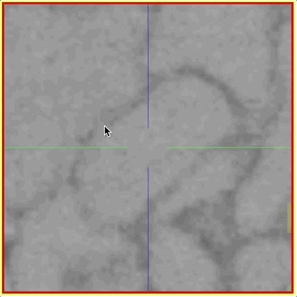
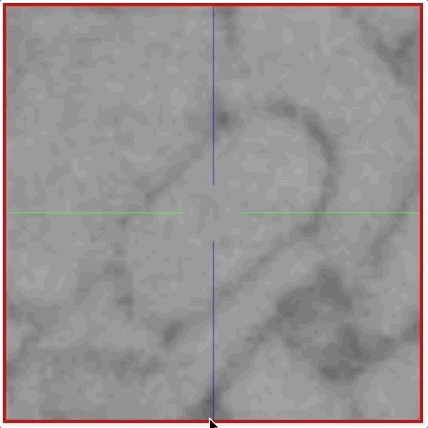
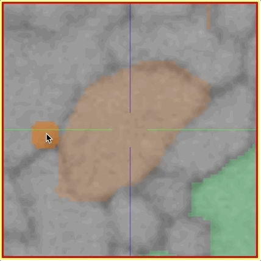

## Volume Annotations & Proof-Reading

In addition to [skeleton annotations](./skeleton_annotation.md), webKnossos also supports volume / segmentation annotations.
With this type of annotation, you can label groups of voxels with efficient drawing tools.


### Tools
Select one of the drawing tools from the toolbar or toggle through with the keyboard shortcut *W*.

- `Move`: Navigate around the dataset.
- `Trace`: Draw outlines around the voxel you would like to label.
- `Brush`: Draw over the voxels you would like to label. Adjust the brush size with *SHIFT + Mousewheel*.
- `Erase (Trace/Brush)`: Draw over the voxels you would like to erase. Adjust the brush size with *SHIFT + Mousewheel*.
- `Fill Tool`: Flood-fills the clicked region with a volume annotation until it hits the next segment boundary (or the outer edge of you viewport). All adjacent voxels with the same voxel id as the clicked voxel will be changed to the active segment ID. Useful to either fill whole in a segment or to relabel a segment with a different ID/color.
- `Segment Picker`: Click on amy segment to select its label ID as the active segment ID and continue any volume annotation operation with that ID.

When using the trace or brush tool, a label can be added with *Left Mouse Drag*.
Erasing is possible with the dedicated erase tools or with *CTRL + Shift + Left Mouse Drag*.

If you have enabled *Classic Controls* in the settings sidebar, erasing is also possible with *Right Mouse Drag* within the brush and trace tool (otherwise, right-clicking is mapped to open a context menu).

The following interactions and modifiers are available when working with the volume annotation tools:
- `Create New Segment ID`: Creates a new segment ID for labell. Note the little color indicator in the top right corner of the button visualizing the current color of the active segment ID.
- `Change Brush Size`: Changes the size of the brushing tool. 
- `Overwrite Everything`: When labelling with the brush/trace tool, you can annotate every available voxel without any regard if it was already labelled as a different segment or whether it is unlabelled. This allows you to draw over existing segments.
- `Only Overwrite Empty Areas`: In contrast to the `Overwrite Everything` modifier, the forces the brush/trace tool to only label voxels without any segment ID ("empty areas"). This is useful when annotating segments that directly touch each other to avoid accidental overwrites.
- `2D Fill`/ `3D Fill`: Modifies the flood filling tool to work in 2D (in-plane only) or 3D (volumetric fill/re-labelling). 3D flood fill is contraint to a small, regional bounding box for performance reasons. Read more about flood fills below.





In the `Segmentation` tab on the right-hand sidepanel, you can see the segment IDs which are available in your annotation. You can rename segments as needed.

The active segment ID under the cursor can be found in the status bar at the bottom of the screen or through the context-sensitive menu on right-click.

### Proof-Reading and Merging Segments

webKnossos support proof-reading of segments from automatic segmentation. With "Merger Mode" individual segments (e.g. from over-segmentation) can be combined ("merged") to refine the segmentation and fix split errors. 

The "merger mode" is available in skeleton and hybrid annotation mode. Mark connected segments by right-clicking and placing nodes in the corresponding segments to merge them together. Several segments can be combined by making sure that all "correcting nodes" are part of the same tree.

"Merger mode" can be enabled in the settings under "Nodes & Trees" with the option "Enable Merger Mode". As soon as you enable it, all already existing trees will be used to form merged segments.

To fix split errors see section on flood filling below.


### Volume Flood Fills
webKnossos supports volumetric flood fills (3D) to relabel a segment with a new ID. Instead of having the relabela segment slice-by-slice webKnossos can do this for you. This operation allows you to fix both split and merge errors:

- For split errors: Combine two segments by relabeling one segment with the ID of the other. Since this operation is fairly compute intensive you might be better of with the `Merger Mode`, explained above.
- For merge errors: You have to manually split two segments at their intersection/border, e.g. a cell boundary. Use the eraser brush and make sure to establish a clear cut between both segments on a slice-by-slice basis. Both segments must not touch any longer. Create a new segment ID from the toolbar and apply to one of the partial segments that you just devided. 

Due to perfomance reasons, 3D flood-fills only work in a small, local bounding box. webKnossos will add bounding box around the affected area. In order to truly propagate the new segment ID(s) throughout a whole dataset, you can trigger a webKnossos job to apply this change globally. From the `BBox` tab in the right-hand menu, press the "Globalize Flood-Fill` button. Make sure to do all local fill operations first and apply them all at once.

Check the `Processing Jobs` page from the `Admin` menu at the top of the screen to track progress or cancel the operation. The finished, processed dataset will appear as new dataset in your dashboard.

### Mappings / On-Demand Agglomeration
With webKnossos it is possible to apply a precomputed agglomeration file to combine over-segmented volume annotations on-demand. Instead of having to materialize one or more agglomeration results as separate segmentation layers, ID mappings allow researchers to apply and compare different agglomeration strategies of their data for experimentation. 

This feature work well with automated machine learning segmentation workflows. We typically produce several agglomeration results based on different prediction and size thresholds leading to several possible segmentations based of one initial over-segmentation. We load these ID map into webKnossos to quickly review these results in an interactive session.


Mapping files are automatically identified by webKnossos when being placed in a `mappings` folder within the [segmentation folder](./data_formats.md#wkw-folder-structure). All available mappings can be activated from a dropdown under each `Segmentation` layer. Due to their file size, mappings are fetched on demand before being applied. Users can easily switch between several mappings and webKnossos will update accordingly.

Mapping files are stored as JSON or HDF5 files. [Read the section on data formats for more information on the file formats](./data_formats.md#id_mappings).

<!--  -->

### Download File Format
Volume annotations can be downloaded and imported using ZIP files that contain [WKW](./data_formats.md#wkw-datasets) datasets.
The ZIP archive contains one NML file that holds meta information including the dataset name and the user's position.
Additionally, there is another embedded ZIP file that contains the volume annotations in WKW file format.

!!!info
    In contrast to on-disk WKW datasets, the WKW files in downloaded volume annotations only contain a single 32^3 bucket in each file.
    Therefore, also the addressing of the WKW files (e.g. `z48/y5444/x5748.wkw`) is in steps of 32 instead of 1024.

```
volumetracing.zip # A ZIP file containing the volume annotation
├─ data.zip # Container for WKW dataset
│ └─ 1 # Magnification step folder
│   ├─ z48
│   │ ├─ y5444
│   │ │ └─ x5748.wkw # Actual WKW bucket file (32^3 voxel)
│   │ └─ y5445/...
│   ├─ z49/...
│   └─ header.wkw # Information about the WKW files
└─ volumetracing.nml # Annotation metadata NML file
```

After unzipping the archives, the WKW files can be read or modified with the WKW libraries that are available for [Python, MATLAB, and other languages](https://github.com/scalableminds/webknossos-wrap/). 

## Hybrid Annotations

A hybrid annotation contains both skeleton and volume annotations. 
This is the default behavior when creating a new webKnossos annotation.

With hybrid annotations, you can use an existing skeleton as a guide to support volume annotation tasks.
Alternatively, comments on skeleton node, could be used to label/mark specific cells and positions during a volume annotation.

webKnossos also supports pure skeleton or pure volume annotations for dedicated tasks/projects or backward compatibility. 
Those can be converted to a hybrid annotation, by clicking the `Convert to Hybrid` button in the info tab.
This conversion cannot be reversed.
