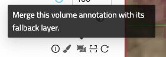

## Volume Annotations & Proof-Reading

In addition to [skeleton annotations](./skeleton_annotation.md), WEBKNOSSOS also supports volume/segmentation annotations.
This annotation type lets you label voxel groups using efficient drawing tools.

### Merging volume annotation with fallback data

After finishing the annotation of a volume layer with a fallback layer, the combined state of these layers can be materialized into a new dataset. For this, go to the layer settings in the left border tab. On the top right of the volume layer is the following button:

This button opens up a modal that starts a long-running job which will materialize the volume annotation.

### Proof-Reading and Merging Segments

See the section on [proofreading](./proof_reading.md).

### AI Quick Select
The built-in quick select tools allows you draw a selection around a cell or object and WEBKNOSSOS will use machine-learning to automatically do the segmentation for you.

The feature is based on the [Segment Anything Model](https://arxiv.org/abs/2304.02643) and works across a wide range of imaging modalities.

The AI quick select tool in combination with the volume interpolation feature speeds ups annotation workflows significantly.

To use the AI quick selection tool, select it from the toolbar at the top of the screen. Make sure the AI option is toggled (default setting) otherwise the quick select tool will default to using flood-fills which depending on your situation is also very handy.

### Volume Interpolation

When using the brush or trace tool, you can use the `Volume Interpolation` feature for faster annotation speed (in a task context, this feature has to be enabled explicitly).
Simply label a segment in one slice (e.g., z=10), move forward by a few slices (e.g., z=14) and label the segment there.
Now, you can click the "Interpolate" button (or use the shortcut V) to interpolate the segment between the annotated slices (e.g., z=11, z=12, z=13).

Note that it is recommended to proofread the interpolated slices afterward since the interpolation is a heuristic.

### Volume Extrusion

Similar to the above interpolation feature, you can also extrude the currently active segment.
This means, that you can label a segment on one slice (e.g., z=10), move a few slices forward (e.g., z=12) and copy the segment to the relevant slices (e.g., z=11, z=12). In contrast to interpolation mode, WEBKNOSSOS will not adapt the shape/boundary of the extruded segments to fit between the source and target segment. Instead, the extruded volume will retain the shape of the source segment and extend that along the z-axis.
The extrusion can be triggered by using the extrude button in the toolbar (also available as a dropdown next to the interpolation/extrusion button).

### Volume Flood Fills

WEBKNOSSOS supports volumetric flood fills (3D) to relabel a segment with a new ID. Instead of having to relabel segment slice-by-slice, WEBKNOSSOS can do this for you. This operation allows you to fix both split and merge errors:

- For split errors: Combine two segments by relabeling one segment with the ID of the other. Since this operation is fairly compute-intensive you might be better of with the `Merger Mode`, explained above.
- For merge errors: You have to manually split two segments at their intersection/border, e.g. a cell boundary. Use the eraser brush and make sure to establish a clear cut between both segments on a slice-by-slice basis. Both segments must not touch any longer. Create a new segment ID from the toolbar and apply it to one of the partial segments that you just divided.

Note that due to performance reasons, 3D flood-fills only work in a small, local bounding box.
For larger areas we recommend working with the [proofreading tool](./proof_reading.md) instead.

## Hybrid Annotations

A hybrid annotation contains both skeleton and volume annotations.
This is the default behavior when creating a new WEBKNOSSOS annotation.

With hybrid annotations, you can use an existing skeleton as a guide to support volume annotation tasks.
Alternatively, comments on skeleton nodes can be used to label/mark specific cells and positions during a volume annotation.

WEBKNOSSOS also supports pure skeleton or pure volume annotations for dedicated tasks/projects or backward compatibility.
Those can be converted to a hybrid annotation, by adding a volume/skeleton layer by clicking the `Add Volume Annotation Layer` button in the left-hand layers tab.
