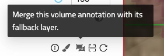

## Import Volume Annotations

To import a volume annotation, ensure it is in the correct format (WKW or Zarr) and compressed in a zip folder. Next, navigate to your annotation dashboard and simply drag and drop the zip folder into the WEBKNOSSOS interface. The annotation will automatically open, allowing you to edit it as usual. It will also be added to your annotation list for future access.

## Export Volume Annotations
To export (download) an annotation, go to **Menu > Download**. From there, select the data you want to download and choose the desired format (WKW, Zarr). Alternatively, you can open your annotation dashboard and click **Download** next to the annotation.

## Merging volume annotation with fallback data

After finishing the annotation of a volume layer with a fallback layer, the combined state of these layers can be materialized into a new dataset. For this, go to the layer settings in the left border tab. On the top right of the volume layer is the following button:

This button opens up a dialog that starts a long-running job which will materialize the volume annotation.
