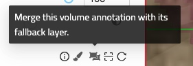

## Import Volume Annotations

A volume annotation is imported as a `.zip` file containing two parts:

- An [NML file](../data/concepts.md#nml-files) — carries the annotation metadata, segment information, and layer configuration.
- A volume data `.zip` — holds the actual voxel label data in either WKW or Zarr format.

Both files must be present in the archive. The NML file can sit anywhere inside the zip; WEBKNOSSOS will locate it automatically.

There are two ways to import:

- **From the dashboard** — drag and drop the zip onto the annotation list to create a new annotation. It will open automatically and appear in your annotation list.
- **From within an open annotation** — drop the zip anywhere in the WEBKNOSSOS viewer to merge the imported data into the current annotation. The volume layer must already exist in the annotation before importing.

For importing skeleton-only (NML) files without volume data, see [Import & Export in Skeleton Annotations](../skeleton_annotation/import_export.md).

## Export Volume Annotations

To download an annotation, open **Menu > Download**, choose the data you want, and select a format (WKW or Zarr). You can also go to your annotation dashboard and click **Download** next to the annotation.

For a full overview of all export and download options — including TIFF cutouts and Python library access — see [Data Export through the Web UI](../data/export_ui.md).

## Merging volume annotation with fallback data

When annotating a volume layer, you can work on top of an existing segmentation from the dataset — known as a [fallback layer](../data/concepts.md#volume-element). Rather than copying the entire segmentation upfront, WEBKNOSSOS stores only your edits in the annotation layer and reads everything else directly from the original segmentation. This keeps annotations lightweight while still letting you see and build on the existing data.

Once you are done annotating, you can permanently combine both layers into a single, self-contained segmentation in a new dataset. Your annotation edits take precedence wherever you made changes; the original fallback segmentation fills in the rest. This process is sometimes referred to as **materialization**.

To start it, go to the layer settings in the left border tab and click the following button on the top right of the volume layer:

/// caption
Icon to open the materialize volume annotation dialog
///

This opens a dialog that submits a long-running job to materialize the volume annotation into a new dataset.

## Restricting magnifications

Volume annotations can be stored at multiple [magnifications](../terminology.md) — `1-1-1` being full resolution, `4-4-2` meaning downsampled by 4× in x/y and 2× in z, and so on. By default, edits are stored at every available magnification, which can significantly increase annotation size when labeling large structures such as nuclei.

Restricting the annotation to a coarser magnification reduces storage overhead and improves the responsiveness of annotation tools such as the brush — the browser has less data to update and upload with each stroke. Annotation quality is not affected, since the label data simply does not need to be recorded at resolutions finer than what was used to annotate. The restriction is set when the volume layer is first created — either at annotation creation or when adding a new layer to an existing annotation.

### When creating an annotation

On the dataset dashboard, click the three-dot menu next to **New Annotation** for the dataset you want to annotate. Use the magnification slider to exclude finer levels — for example, skipping `1-1-1` or the two finest magnifications is a common choice for large structures.

### When adding a new volume annotation layer

In an open annotation, go to the **Layers** tab on the left sidebar and click **Add Volume Annotation Layer** at the bottom of the layer list. The same magnification slider is available there.