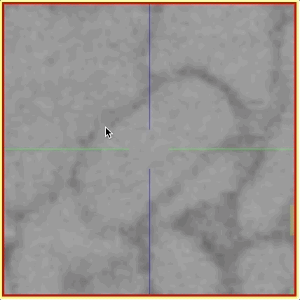
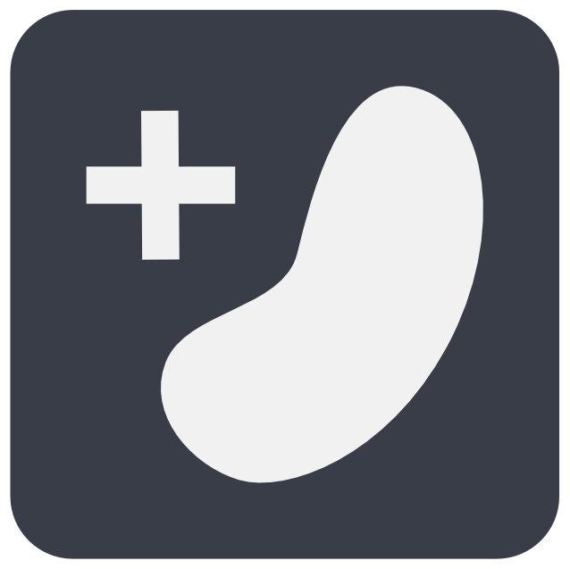

# Volume annotation tools
## Tool overview

Choose a volume annotation drawing tool from the [toolbar](../ui/toolbar.md).

{align=left width="60"}
**Trace Tool**: Create precise boundary definitions by drawing outlines around structures. This tool is particularly useful when accuracy is crucial. For added precision consider using a [pen input device](../pen_tablets.md). 

{align=left width="60"} 
**Brush Tool**: Paint directly onto the dataset to mark regions of interest. The brush size is adjustable and . If you draw around objects in one continuous motion, the inside will be filled automatically. Use ++shift++ + _Mousewheel_ to change the brush size.

{align=left width="60"} 
 **Eraser (Trace/Brush)**: Erase voxels by drawing over them deleting any labels. Behaves identical to the Trace/Brush tools above. Use ++shift++ + _Mousewheel_ to change the brush size.

{align=left width="60"} 
**Fill Tool**: Fill the clicked region with a volume annotation up to the next segment boundary (or the edge of your viewport). All neighboring voxels with the same voxel id as the clicked voxel will be labelled with the active segment ID. This is useful for filling a hole in a segment or relabeling a segment with a different ID/color. Read more about the fill tool below.

{align=left width="60"} 
**Segment Picker**: Click any segment to use its label ID as the active segment ID and keep annotating with that ID. This is alternative to selecting the segment ID from the [Segments list](./segments_list.md) sidebar or context menu.

{align=left width="60"} 
**Quick Select**: Annotate a segment automatically by drawing a rectangular selection over it. By default this tools us our AI for segmentation but also has a threshold-based mode. Read more about the quick-select tool below.

{align=left width="60"} 
**Proof Reading**: Fix merge and split errors in automated segmentations using the underlying super-voxel graph by combining and breaking apart segments. Read more about [proofreading](../proofreading/tools.md).

{align=left width="60"} 
**Interpolation/Extrusion**: Annotate a segment, skip a few sections in the Z direction, and annotate it again. Now, you can interpolate between the two segments. Read more on the interpolation/extrusion tool below. 

### Tool Modifiers
The following interactions and modifiers become available when working with some of the volume annotation tools. They can be found in the toolbar:

{align=left width="60"} 
**Create New Segment ID**: Creates a new segment ID for labeling with a different color and identifier. New segments will be added to the [segments list](./segments_list.md) in the right sidebar automatically.

{align=left width="60"} 
**Change Brush Size**: Changes the size and radius of the brushing tool. Presets of small, medium and large brush sizes are available which can be modified to suite your workflows. 

{align=left width="60"} 
**Overwrite Everything**: When labeling with the brush/trace tool, you can annotate every available voxel without any regard if it was already labeled as a different segment or whether it is unlabelled. This allows you to draw over existing segments.

{align=left width="60"} 
**Only Overwrite Empty Areas**: In contrast to the `Overwrite Everything` modifier, the forces the brush & trace tools to only label voxels without any segment ID ("empty areas"). This is useful when annotating segments that directly touch each other to avoid accidental overwrites.

{align=left width="60"} 
{align=left width="60"} 
**2D Fill`/ `3D Fill**: Modifies the flood filling tool to work in 2D (in-plane only) or 3D (volumetric fill/re-labeling). 3D flood fill is constrained to a small, regional bounding box for performance reasons. Read more about flood fills below.

In the `Segmentation` tab on the right-hand side panel, you can see the segment IDs which are available in your annotation. You can rename segments as needed.

The active segment ID under the cursor can be found in the status bar at the bottom of the screen or through the context-sensitive menu on right-click.

## Quick-select tool
The built-in quick select tools allows you draw a selection around a cell or object and WEBKNOSSOS will use machine-learning to automatically do the segmentation for you. The feature is based on the [Segment Anything Model 2](https://ai.meta.com/blog/segment-anything-2/) and works across a wide range of imaging modalities.

When the "AI" button in the toolbar is activated, a machine-learning model is used to infer the selection. When the AI button is disabled, the tool operates on the intensity data of the visible color layer and automatically fills out the segment starting from the center of the rectangle. Next to the tool, there is a settings button which allows to enable a preview mode and to tweak some other parameters. When the preview is enabled, you can fine-tuned the parameters and see the preview update instantly.

Choose the quick-select tool from the toolbar. Activate AI and go to the settings icon in the toolbar to set the number of sections for the prediction. Then, click a cell on your EM data or draw a rectangle around the cell to segment. WEBKNOSSOS will label the cell across the chosen number of sections. 

## Volume Interpolation

When using the brush or trace tool, you can use the `Volume Interpolation` feature for faster annotation speed (in a task context, this feature has to be enabled explicitly).
Simply label a segment in one slice (e.g., z=10), move forward by a few slices (e.g., z=14) and label the segment there.
Now, you can click the "Interpolate" button (or use the shortcut V) to interpolate the segment between the annotated slices (e.g., z=11, z=12, z=13).

Note that it is recommended to proofread the interpolated slices afterward since the interpolation is a heuristic.

## Volume Extrusion

Similar to the above interpolation feature, you can also extrude the currently active segment.
This means, that you can label a segment on one slice (e.g., z=10), move a few slices forward (e.g., z=12) and copy the segment to the relevant slices (e.g., z=11, z=12). In contrast to interpolation mode, WEBKNOSSOS will not adapt the shape/boundary of the extruded segments to fit between the source and target segment. Instead, the extruded volume will retain the shape of the source segment and extend that along the z-axis.
The extrusion can be triggered by using the extrude button in the toolbar (also available as a dropdown next to the interpolation/extrusion button).

## Volume Flood Fills

WEBKNOSSOS supports volumetric flood fills (3D) to relabel a segment with a new ID. Instead of having to relabel segment slice-by-slice, WEBKNOSSOS can do this for you. This operation allows you to fix both split and merge errors:

- For split errors: Combine two segments by relabeling one segment with the ID of the other. Since this operation is fairly compute-intensive you might be better of with the [Merger Mode](../proofreading/merger_mode.md).
- For merge errors: You have to manually split two segments at their intersection/border, e.g. a cell boundary. Use the eraser brush and make sure to establish a clear cut between both segments on a slice-by-slice basis. Both segments must not touch any longer. Create a new segment ID from the toolbar and apply it to one of the partial segments that you just divided.

Note that due to performance reasons, 3D flood-fills only work in a small, local bounding box.
For larger areas we recommend working with the [proofreading tool](../proofreading/tools.md) instead.

