# Call graph: `example_fragment_shader.glsl`

This is a **static** call graph of the generated fragment shader. The shader was
generated by `getMainFragmentShader()` in
`frontend/javascripts/viewer/shaders/main_data_shaders.glsl.ts` for 5 color
layers and **no segmentation layer** (`hasSegmentation === false` — none of
`getSegmentId`, `convertCellIdToRGB`, `getBrushOverlay`,
`getProofreadingCrossHairOverlay`, `getSegmentationAlphaIncrement` appear in
the compiled output, so they're not in the graph either).

The 5 color layers (base64-decoded uniform prefixes) are:

- `layer_Y29sb3JfZmxvYXQ` → `color_float`
- `layer_Y29sb3JfZmxvYXRfc21hbGw` → `color_float_small`
- `layer_Y29sb3JfdWludDE2` → `color_uint16`
- `layer_Y29sb3JfdWludDI0` → `color_uint24`
- `layer_Y29sb3JfdWludDg` → `color_uint8`

## Legend

- 🟨 **Yellow** — generated once *per data layer* (`main_data_shaders.glsl.ts` /
  `texture_access.glsl` emit one copy of this function per layer via
  `each(layerNamesWithSegmentation, ...)`).
- ⬜ **Gray, dashed border** — defined (pulled in as part of a shared module)
  but **never called** in this particular compiled shader (dead code for this
  configuration — e.g. bilinear/trilinear filtering isn't used because
  `useInterpolation` is off, and segmentation helpers aren't used because
  there's no segmentation layer).
- Edges labeled `×5` are executed once per color layer, but they call into a
  **single, shared** function (the loop body is unrolled/templated in
  `main()`, it doesn't generate 5 separate functions).

```mermaid
flowchart TD
    classDef perLayer fill:#fff3a3,stroke:#b8960c,color:#000
    classDef unused fill:#eeeeee,stroke:#999999,stroke-dasharray: 4 3,color:#666

    main["main()"]

    %% coordinate helpers
    getWorldCoordUVW["getWorldCoordUVW()"]
    worldCoordToUVW["worldCoordToUVW()"]
    inverseMatrix["inverseMatrix()"]
    isFlightMode["isFlightMode()"]
    transDim["transDim()"]
    getAbsoluteCoords["getAbsoluteCoords()"]
    getMagnification["getMagnification()"]
    getMagnificationFactors["getMagnificationFactors()"]
    isOutsideOfBoundingBox["isOutsideOfBoundingBox()"]
    div["div()"]

    %% color / bucket lookup pipeline
    getMaybeFilteredColorOrFallback["getMaybeFilteredColorOrFallback()"]
    getMaybeFilteredColor["getMaybeFilteredColor()"]
    getColorForCoords["getColorForCoords()"]
    getColorForCoords64["getColorForCoords64()"]
    lookUpBucket["lookUpBucket()"]
    attemptLookUpLookUp["attemptLookUpLookUp()"]
    hashCombine["hashCombine()"]
    linearizeVec3ToIndex["linearizeVec3ToIndex()"]
    linearizeVec3ToIndexWithMod["linearizeVec3ToIndexWithMod()"]

    %% per-layer dispatch
    getRgbaAtXYIndex["getRgbaAtXYIndex()<br/>(dispatcher)"]

    %% blending
    blendLayersAdditive["blendLayersAdditive()"]
    blendLayersCover["blendLayersCover()"]
    blendLayersCoverBlackAsTransparent["blendLayersCoverBlackAsTransparent()"]
    scaleFloatToFloat["scaleFloatToFloat()"]

    %% unused / dead code in this build
    getW["getW()"]
    getBilinearColorFor["getBilinearColorFor()"]
    getTrilinearColorFor["getTrilinearColorFor()"]
    getSegmentIdOrFallback["getSegmentIdOrFallback()"]
    almostEq["almostEq()"]
    scaleIntToFloat["scaleIntToFloat()"]

    %% per-layer generated functions
    subgraph PerLayer["Generated once per data layer"]
        direction LR
        getRgbaAtXYIndex_float["getRgbaAtXYIndex_layer_color_float()"]
        getRgbaAtXYIndex_floatSmall["getRgbaAtXYIndex_layer_color_float_small()"]
        getRgbaAtXYIndex_uint16["getRgbaAtXYIndex_layer_color_uint16()"]
        getRgbaAtXYIndex_uint24["getRgbaAtXYIndex_layer_color_uint24()"]
        getRgbaAtXYIndex_uint8["getRgbaAtXYIndex_layer_color_uint8()"]
    end

    %% main() entry
    main --> getWorldCoordUVW
    main -- "debug branch" --> getAbsoluteCoords
    main -- "debug branch" --> div
    main -- "×5, once per color layer" --> isOutsideOfBoundingBox
    main -- "×5, once per color layer" --> getMaybeFilteredColorOrFallback
    main -- "×5, once per color layer" --> scaleFloatToFloat
    main -- "×5, once per color layer" --> blendLayersAdditive
    main -- "×5, once per color layer" --> blendLayersCover
    main -- "×5, once per color layer" --> blendLayersCoverBlackAsTransparent

    getWorldCoordUVW --> worldCoordToUVW
    worldCoordToUVW --> transDim
    worldCoordToUVW --> isFlightMode
    worldCoordToUVW --> inverseMatrix

    getAbsoluteCoords --> getMagnification
    getAbsoluteCoords --> transDim
    isOutsideOfBoundingBox --> transDim

    getMaybeFilteredColorOrFallback --> getMaybeFilteredColor
    getMaybeFilteredColor --> getColorForCoords
    getColorForCoords --> getColorForCoords64

    getColorForCoords64 --> getAbsoluteCoords
    getColorForCoords64 --> div
    getColorForCoords64 --> transDim
    getColorForCoords64 --> lookUpBucket
    getColorForCoords64 --> getMagnificationFactors
    getColorForCoords64 --> linearizeVec3ToIndexWithMod
    getColorForCoords64 --> linearizeVec3ToIndex
    getColorForCoords64 --> getRgbaAtXYIndex

    getMagnificationFactors --> getMagnification

    lookUpBucket --> attemptLookUpLookUp
    attemptLookUpLookUp --> hashCombine

    getRgbaAtXYIndex --> getRgbaAtXYIndex_float
    getRgbaAtXYIndex --> getRgbaAtXYIndex_floatSmall
    getRgbaAtXYIndex --> getRgbaAtXYIndex_uint16
    getRgbaAtXYIndex --> getRgbaAtXYIndex_uint24
    getRgbaAtXYIndex --> getRgbaAtXYIndex_uint8

    blendLayersCoverBlackAsTransparent --> blendLayersCover

    %% dead code, still present in the compiled source
    getBilinearColorFor --> getColorForCoords
    getTrilinearColorFor --> getColorForCoords
    getSegmentIdOrFallback --> getColorForCoords64

    class getRgbaAtXYIndex_float,getRgbaAtXYIndex_floatSmall,getRgbaAtXYIndex_uint16,getRgbaAtXYIndex_uint24,getRgbaAtXYIndex_uint8 perLayer
    class getW,getBilinearColorFor,getTrilinearColorFor,getSegmentIdOrFallback,almostEq,scaleIntToFloat unused
```

## Notes

- `getRgbaAtXYIndex_<layer>()` is the **only** truly distinct function
  generated per data layer in this shader (see the `each(...)` loop in
  `texture_access.glsl`, invoked from `main_data_shaders.glsl.ts`). The
  dispatcher `getRgbaAtXYIndex()` picks the right one via an `if/else` chain
  on `localLayerIndex`, because WebGL doesn't support dynamic sampler array
  indexing.
- All the other per-layer-looking code in `main()` (bounding-box check, alpha
  blending, gamma/min-max scaling, …) is templated/unrolled **inline** inside
  the single `main()` function body — one block per layer, not a separate
  function per layer — so it shows up as repeated (`×5`) calls into shared
  functions rather than as separate nodes.
- Overloaded functions (`div`, `almostEq`, `linearizeVec3ToIndex`) are
  collapsed into a single node each.
