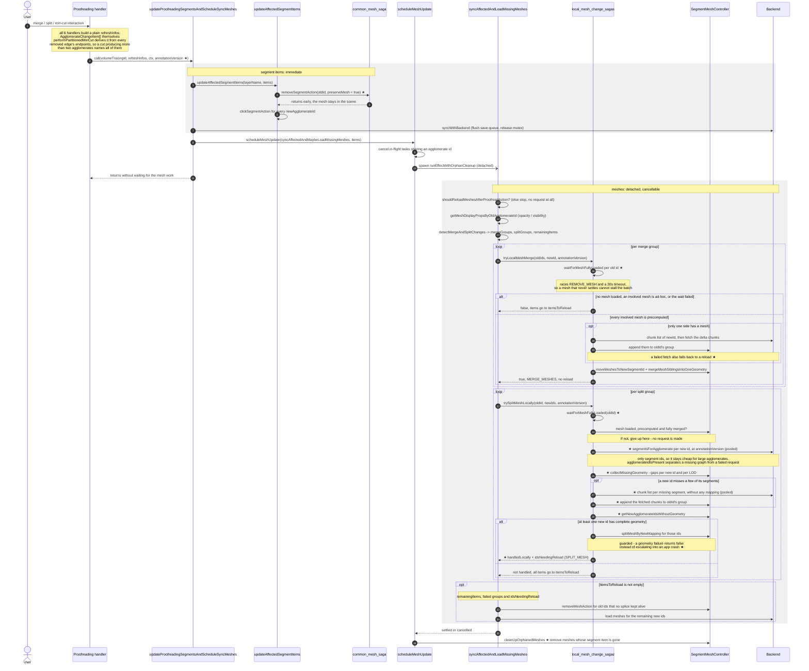

# Local mesh refreshing after a proofreading action

Call hierarchy from a proofreading interaction down to the mesh refreshing.
★ marks the mechanisms this feature introduces.

## What the diagram shows

1. **One shared tail.** All six handlers (`handleProofreadMerge`, `handleMinCutAgglomerate`,
   `performPartitionedMinCut`, `handleProofreadCutFromNeighbors`, `handleMergeViaTree`,
   `handleSplitViaTree`) go through `updateProofreadingSegmentsAndScheduleSyncMeshes` with a
   pre-built array, instead of four of them duplicating the tail inline.

2. **`preserveMesh`.** The segment item still disappears immediately (the save queue depends on
   it), but the mesh survives into the detached phase, which is what makes a local splice possible
   at all - previously `handleRemoveSegment` had already disposed the geometry before
   `tryLocalMeshMerge` ran.

3. **A pinned `annotationVersion`.** The mesh work runs detached, so by the time it asks the
   back-end anything, an unrelated action may already have raised the annotation version. Each
   handler therefore passes the version its operation was saved at - the same one handed to
   `splitAgglomerateInMapping` - so the segment lists match the mapping that was just built.

4. **Authoritative segment lists instead of scene inspection.** A split asks
   `segmentsForAgglomerate` which segments each new agglomerate consists of, rather than reading
   the loaded mesh's supervoxels and classifying them against the partial local mapping. Chunk
   descriptors would carry the same information, but also every chunk's position and byte range,
   which is slow exactly for the large agglomerates this feature exists to speed up.

5. **Completing the mesh before splitting.** Segments that belong to the mesh but have no geometry
   in the scene are fetched first, one cheap chunk listing per missing segment, requested without a
   mapping so the back-end does not expand the id into a whole agglomerate. The gaps are tracked
   per LOD, because a segment can have geometry for one LOD but not for another. A new id missing
   all or more than `MAX_SEGMENTS_TO_COMPLETE_PER_AGGLOMERATE` of its segments is left out -
   reloading its mesh as a whole is cheaper.

6. **Partial local splits.** A new id that ends up without complete geometry no longer cancels the
   whole split. It is reported back as `idsNeedingReload`, the other fragments keep their spliced
   mesh, and only the reported ones are loaded again.

7. **Every local path can decline.** Waiting for a mesh is bounded, an ad-hoc mesh is never spliced
   (it covers only the agglomerate it was computed for), a failed chunk fetch is reported rather
   than silently accepted, and the scene-graph surgery is guarded. Each of these returns "not
   handled locally", which routes the items into the ordinary reload path - the behaviour before
   this feature existed.

8. **Pooled requests.** The segment-list requests of a split, and the chunk listings of its missing
   segments, run through `processTaskWithPool` rather than one after another, so an N-way split
   does not serialize N round trips.

9. **`cleanUpOrphanedMeshes` in a `finally`.** Now that disposal happens inside the cancellable
   task, a task cancelled by a newer overlapping one could otherwise leave a mesh alive with no
   segment item and no owner.

The two `rect` blocks mark the synchronous/detached boundary - the tail returns before any mesh
work happens, which is what makes several test expectations in this PR non-obvious.
